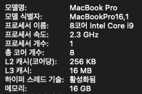
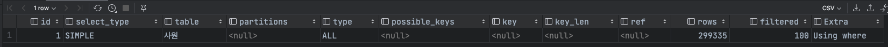

## SQL 단순 수정으로 착한 쿼리 만들기

`local PC 사양`




### 1. 사원번호가 1100 으로 시작하면서 사원번호가 5자리인 사원 번호를 모두 출력

`튜닝 전: 162ms`

```mysql
explain
select *
from 사원
where substr(사원번호, 1, 4) = 1100
and length(사원번호) = 5;
```



1. 내부 조인이 없는 쿼리문이며, 풀 테이블 스캔을 하였다. where 절의 필터 조건을 사용해 MySQL 엔진으로 가져온 데이터를 추출하였다.
2. 해당 쿼리가 풀 테이블 스캔으로 동작하는 이유는 column 을 변형하여 사용하였기 때문이다. 인덱스를 사용하기 위해서는 컬럼 값을 변형해서는 안됀다.

<br>

`튜닝 후: 54ms`

```mysql
explain
select *
from 사원
where 사원번호 between 11000 and 11009;
```


1. 내부 조인이 없는 쿼리문이며, `BETWEEN` 을 이용해 테이블 내의 연속된 데이터 범위를 조회하였다.
2. 옵티마이저가 최적화 하기 위한 `PRIMARY INDEX` 인덱스를 사용하였고, 사용한 인덱스의 바이트 수는 `4 byte` 이다.
3. 수행하고자 접근한 데이터의 수(row)가 10건이므로 이전의 탐색하는 데이터 건수가 감소하였다.

<br>

### 2. 사원 테이블에서 성별을 기준으로 몇 명의 사원이 있는지 출력

`튜닝 전: 180ms`

```mysql
explain
select ifnull(성별, 'NO DATA') as 성별, count(1) 건수
from 사원
group by ifnull(성별, 'NO DATA');
```

1. **I_성별_성** 인덱스를 `index full scan` 했고 인덱스의 모든 데이터를 탐색했다.
2. 사용한 인덱스의 바이트 수는 `51 byte` 이며, 인덱스만을 읽고(`Using index`) 중간 결과를 저장하고자 임시 테이블을 생성하였다.(`Using temporary`)

<br>

`튜닝 후: 99ms`

```mysql
explain
select 성별, count(1) 건수
from 사원
group by 성별;
```

1. 튜닝 전과 동일하게 **I_성별_성** 인덱스를 `index full scan` 했지만 임시 테이블을 생성하지 않은 덕분에 성능이 향상되었다.


