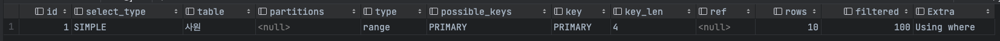

## SQL 단순 수정으로 착한 쿼리 만들기

`local PC 사양`


### 1. 사원번호가 1100 으로 시작하면서 사원번호가 5자리인 사원 번호를 모두 출력

`튜닝 전`

```mysql
explain
select *
from 사원
where substr(사원번호, 1, 4) = 1100
and length(사원번호) = 5;
```


1. 내부 조인이 없는 쿼리문이며, 풀 테이블 스캔을 하였다. where 절의 필터 조건을 사용해 MySQL 엔진으로 가져온 데이터를 추출하였다.
2. 해당 쿼리가 풀 테이블 스캔으로 동작하는 이유는 column 을 변형하여 사용하였기 때문이다. 인덱스를 사용하기 위해서는 컬럼 값을 변형해서는 안됀다.

<br>

`튜닝 후`

```mysql
explain
select *
from 사원
where 사원번호 between 11000 and 11009;
```



1. 내부 조인이 없는 쿼리문이며, `BETWEEN` 을 이용해 테이블 내의 연속된 데이터 범위를 조회하였다.
2. 옵티마이저가 최적화 하기 위한 `PRIMARY INDEX` 인덱스를 사용하였고, 사용한 인덱스의 바이트 수는 `4 byte` 이다.
3. 수행하고자 접근한 데이터의 수(row)가 10건이므로 이전의 탐색하는 데이터 건수가 감소하였다.

<br>

### 2. 사원 테이블에서 성별을 기준으로 몇 명의 사원이 있는지 출력

`튜닝 전`

```mysql
explain
select ifnull(성별, 'NO DATA') as 성별, count(1) 건수
from 사원
group by ifnull(성별, 'NO DATA');
```

1. **I_성별_성** 인덱스를 `index full scan` 했고 인덱스의 모든 데이터를 탐색했다.
2. 사용한 인덱스의 바이트 수는 `51 byte` 이며, 인덱스만을 읽고(`Using index`) 중간 결과를 저장하고자 임시 테이블을 생성하였다.(`Using temporary`)

<br>

`튜닝 후`

```mysql
explain
select 성별, count(1) 건수
from 사원
group by 성별;
```

1. 튜닝 전과 동일하게 **I_성별_성** 인덱스를 `index full scan` 했지만 임시 테이블을 생성하지 않은 덕분에 성능이 향상되었다.

<br>

### 3. 현재 유효한 급여 정보를 조회하고자 사용여부가 1인 값을 찾는 쿼리

`튜닝 전`

```mysql
explain
select count(1)
from 급여
where 사용여부 = 1;
```


1. `I_사용여부` 인덱스를 통해 `full index scan` 하고, 스토리지 엔진에서 MySQL 엔진으로 가져와 그 중 10% 데이터를 필터링하여 최종 출력하였다.
2. where 절의 필터 조건을 사용해 MySQL 엔진으로 가져온 데이터를 추출하였다.
3. 컬럼 값을 숫자 값으로 사용하며 `묵시적 형변환` 이 발생했다. 이로 인해 인덱스를 적절하게 활용하지 못해 전체 데이터를 스캔하였다.

<br>

`튜닝 후`

```mysql
explain
select count(1)
from 급여
where 사용여부 = '1';
```

1. 컬럼 타입인 **char(1)** 을 그대로 활용하여 검색하는 데이터 범위를 제거하였다. 또한 `extra` 컬럼에서 `where 절을 통한 필터 조건`이 제거되었다.
2. 적절한 인덱스 활용으로 스토리지 엔진에서 MySQL 엔진으로 적절한 데이터만을 전달 및 필터링 동작이 없어 성능이 개선되었다.

> ❓ 데이터 컬럼 타입을 그대로 활용해야 인덱스를 적절하게 사용할 수 있는 이유는 무엇일까?


1. <u>형변환을 하면 인덱스를 사용할 수 있지만, 추가 연산이 필요</u>해 빠르게 데이터를 찾는 이점이 사라진다.
2. 형변환을 할 경우, <u>기존 인덱스를 정렬된 데이터 구조의 인덱스 컬럼 순서를 변경하는 경우</u>가 있어 인덱스 사용에 방해가 될 수 있다. (by. collation)
3. 데이터 분포 및 통계 정보가 변경되어 잘못된 실행 계획을 수립하여 동작할 수 있다.

<br>

### 4. 사원 테이블에서 성별의 값과 1칸의 공백, 성의 값을 모두 결합한 결과가 **M Radwan** 인 데이터를 조회

`튜닝 전`

```mysql
explain
select *
from 사원
where concat(성별, ' ', 성) = 'M Radwan';
```


1. 풀 테이블 스캔(type=ALL) 으로 동작하고 mysql 엔진에서 where 절을 통한 필터링하여 데이터를 전달한다.

`튜닝 후`

```mysql
explain
select *
from 사원
where 성별 = 'M'
    and 성 = 'Radwan';

```


1. 사원 테이블의 `I_성별_성` 인덱스를 사용해서 사원 테이블에 접근했다. 102건의 데이터에만 접근하므로 엑세스 범위가 준 것을 확인할 수 있다.
   - Unique Key 가 아닌 `인덱스 등가비교`, 여러 개 행에 접근할 가능성이 있다. ([[참고] Yun Blog](https://cheese10yun.github.io/mysql-explian/))
   - ref 칼럼의 경우 접근 방법이 ref 인 경우 참조 조건(동등 비교 조건)으로 어떤 값이 제공됐는지 보여준다. ([[참고] [MySQL] 실행계획2 (EXPLAIN)](https://velog.io/@ddongh1122/MySQL-%EC%8B%A4%ED%96%89%EA%B3%84%ED%9A%8D2-EXPLAIN))

<br>

### 5. 부서 관리자의 사원번호와 이름, 성, 부서번호 데이터를 중복 제거하여 조회하는 쿼리

`튜닝 전`

```mysql
explain
    select distinct 사원.사원번호, 사원.이름, 사원.성, 부서관리자.부서번호
    from 사원
             join 부서관리자 on 사원.사원번호 = 부서관리자.사원번호;
```


1. 드라이빙 테이블인 부서 관리자 테이블과 그리븐 테이블인 사원 테이블 id 값들이 둘 다 1로 동일하게 나타나므로 조인한다고 수행한다.
2. 부서관리자 테이블에서 `index full scan` 방식으로 수행한다.
3. `DISTINCT` 를 사용하고자 별도의 임시 테이블을 생성해서 동작한다.
    - `DISTINCT` : 내부적으로 나열된 열들을 정렬 후, 중복된 데이터를 삭제한다.

      <br>

```mysql
explain
    select 사원.사원번호, 사원.이름, 사원.성, 부서관리자.부서번호
    from 사원
             join 부서관리자 on 사원.사원번호 = 부서관리자.사원번호;
```

1. `DISTINCT` 로 인해 생성되는 임시 테이블 제거

<br>

### 6. 사원 테이블에서 입사일자 값이 '1989' 로 시작하면서 사원번호가 100000 를 초과하는 데이터를 조회하는 쿼리

```튜닝 전```

```mysql
explain
select 사원번호
from 사원
where 입사일자 LIKE '1989%'
and 사원번호 > 100000;
```


1. `index range scan` 으로 수행하지만 스토리지 엔진에서 mysql 엔진에서 필터 조건으로 11.11 % 데이터를 추출하므로 튜닝 개선이 필요

```튜닝 후```

```mysql
explain
select 사원번호
from 사원
where 입사일자 >= '1989-01-01' and 입사일자 < '1990-01-01'
and 사원번호 > 100000;
```


1. `I_입사일자` 인덱스를 통해 `covering index scan` 를 수행한다.
   - `covering index` : where, group by, order by 검색 조건들이 모두 인덱스를 사용하는 경우 (테이블을 접근하지 않기 때문에 성능이 빠르다.)
2. 스토리지 엔진으로 부터 `I_입사일자` 인덱스의 데이터를 가지고 온 후, MySQL 엔진에서 사원 번호에 대한 필터링에 대한 필터 조건으로 데이터를 추출했다.

<br>

### 7. B 출입한 이력이 있는 정보를 모두 조회하는 쿼리

```mysql
explain
select *
from 사원출입기록
where 출입문 = 'B';
```


1. 사원출입기록 테이블을 `I_출입문` 인덱스를 사용하여 데이터에 접근한다. 이 때 출입문 B 의 대한 상수 조건으로 데이터 접근 범위를 줄여 `ref = const` 가
   출력된다. 
2. 옵티마이저의 실행 계획이 모두 맞지는 않다. 출입문 B 해당 데이터가 50% 이므로 인덱스를 통한 방법이 효율적인지 확인해야 한다.

<br>

```mysql
explain
select *
from 사원출입기록 ignore index (I_출입문)
where 출입문 = 'B';
```

1. 검색하고자 하는 데이터의 범위가 20% 넘어가고 인덱스를 통한 수행 시간이 더욱 오래 걸릴 경우, 인위적으로 인덱스를 무시할 수 있는 `INGORE_INDEX`
   예약어를 사용할 수 있다.

<br>

### 8. 입사일자가 1994년 1월 1일부터 2000년 12월 31일까지인 사원의 이름과 성을 조회하는 쿼리

`튜닝 전`

```mysql
explain
select 이름, 성
from 사원
where 입사일자 between str_to_date('1994-01-01', '%Y-%m-%d')
    and str_to_date('2000-01-01', '%Y-%m-%d');
```


`튜닝 후`

```mysql
explain
select 이름, 성
from 사원
where year(입사일자) between '1994' and '2000';
```

1. 입사시간 열 기준 매번 수년에 걸친 데이터 조회가 잦은 경우에는 인덱스 레인지 스캔 이후, 랜덤 엑세스를 방법과 풀테이블 스캔 방식을 검토해볼 필요가 있다.
2. year 함수를 통해 강제로 인덱스를 사용자히 않는 방식으로 로직을 적용할 수 있다. (아직은 그닥 와닿는 방법은 예제는 아닌 것 같다.
   (책 예제에는 1.2sec vs 0.2sec))

