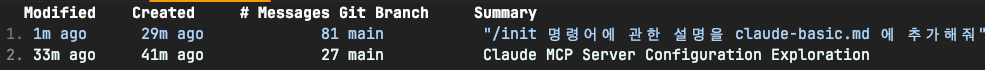

# Claude Code 기본 사용법

## 1. 초기 설정

### (1) /init 명령어

- Claude Code를 처음 사용할 때 프로젝트 초기화를 위해 사용하는 명령어

**사용법:**
```
/init
```

**기능:**
- 현재 디렉토리를 Claude Code 작업 공간으로 설정
- 프로젝트의 구조와 설정을 분석
- Claude Code가 프로젝트를 이해할 수 있도록 초기화 수행
- **claude.md 파일 자동 생성**

**자동 생성되는 파일:**
- `CLAUDE.md`: 프로젝트별 설정과 정보를 저장하는 파일
  - 프로젝트별 커스텀 설정
  - 자주 사용하는 명령어 기록
  - 프로젝트 컨텍스트 및 작업 히스토리
  - 개발팀 간 공유 가능한 Claude Code 사용 가이드

**사용 케이스**
- 새로운 프로젝트에서 Claude Code를 처음 시작할 때
- 기존 프로젝트를 Claude Code로 작업하기 시작할 때
- 프로젝트 설정을 다시 초기화하고 싶을 때

## 2. 데이터 파이핑 (Data Piping)

Claude Code 에서 데이터를 효율적으로 전달하고 처리하는 방법

### (1) 파일 데이터 파이핑
```bash
# 파일 내용을 Claude에게 전달
cat data.json | claude "이 JSON 데이터를 분석해줘"

# 여러 파일 결합하여 전달
cat *.md | claude "이 문서들을 요약해줘"
```

### (2) 명령어 출력 파이핑
```bash
# Git 로그를 Claude에게 전달
git log --oneline -10 | claude "이 커밋 히스토리를 분석해줘"

# 프로세스 목록 분석
ps aux | claude "높은 메모리를 사용하는 프로세스를 찾아줘"

# 파일 목록 전달
ls -la | claude "이 디렉토리 구조를 설명해줘"
```

### (3) 데이터 변환 파이핑
```bash
# CSV 데이터 처리
cat sales.csv | claude "이 판매 데이터에서 월별 트렌드를 분석해줘"

# 로그 파일 분석
tail -100 error.log | claude "이 에러 로그에서 패턴을 찾아줘"
```

### (4) 코드 리뷰 파이핑
```bash
# 코드 변경사항 검토
git diff | claude "이 변경사항을 리뷰해줘"

# 특정 파일의 코드 분석
cat app.js | claude "이 코드의 성능을 개선할 방법을 제안해줘"
```

### (5) 파이핑 활용 팁
- **작은 단위로 나누기**: 큰 파일은 head, tail로 일부분만 전달
- **필터링 활용**: grep, awk 등으로 필요한 부분만 추출
- **형식 지정**: 출력 형식을 명확히 지정하여 더 나은 분석 결과 얻기

## 3. --continue & --resume : 세션 사용 및 리스팅 질문하기

Claude Code 에서 이전 세션을 관리하고 이어서 작업하는 방법

### (1) claude --continue 명령어

이전 세션의 컨텍스트를 이어서 작업할 수 있는 명령어입니다.

**사용법:**
```bash
claude --continue
# 또는 축약형
claude --c
```

**기능:**
- 이전 대화 세션의 컨텍스트 복원
- 중단된 작업을 이어서 진행
- 프로젝트 상태와 이전 논의 내용 유지

**사용 케이스:**
- 이전에 작업하던 코드 개선을 계속 진행할 때
- 중단된 디버깅 세션을 재개할 때
- 이전 논의 내용을 바탕으로 추가 작업할 때

**활용 예시:**
```bash
# 이전 세션 이어서 시작
claude --continue
claude --c

# 이어서 구체적인 작업 요청
claude --c "앞서 논의한 React 컴포넌트 최적화를 완료해줘"
```

### (2) claude --resume 명령어

특정 세션을 선택하여 재개할 수 있는 명령어입니다.

**사용법:**
```bash
# 특정 세션 ID로 재개
claude --resume abc123 "작업 계속해줘"

# 대화형으로 세션 선택
claude --resume
```

**기능:**
- 특정 세션 ID를 지정하여 직접 재개
- 대화형 모드로 이전 세션 목록에서 선택
- 선택한 세션의 전체 컨텍스트 복원

**continue vs resume 차이점:**
- `--continue` / `-c`: 현재 디렉토리의 **가장 최근** 세션을 자동으로 로드
- `--resume` / `-r` : **특정 세션**을 선택하거나 대화형으로 선택 가능

**활용 예시:**
```bash
# 대화형 세션 선택 (목록이 표시됨)
claude --resume

# 특정 세션으로 바로 재개
claude --resume abc123

# 재개와 동시에 새로운 작업 요청
claude --resume abc123 "이전 코드에서 에러 처리를 추가해줘"
```



## 4. -p : Headless Mode (비대화형 모드)

Claude Code를 대화형 세션 없이 일회성으로 사용하는 방법입니다.

### (1) claude --print 명령어

**사용법:**
```bash
claude --print "질문이나 요청"
# 또는 축약형
claude -p "질문이나 요청"
```

**기능:**
- 대화형 세션을 시작하지 않고 일회성으로 실행
- 결과를 출력하고 즉시 종료
  <br> (--resume 명령어을 통해 세션 조회 가능)
- 파이프라인이나 스크립트에서 활용 가능
- 자동화된 작업에 적합

**활용 예시:**
```bash
# 간단한 코드 분석
claude --print "이 함수의 시간복잡도는?"

# 파일 내용 분석
cat config.json | claude --print "이 설정의 보안 이슈를 찾아줘"

# 스크립트에서 활용
result=$(echo "Hello World" | claude --print "이 텍스트를 대문자로 변환해줘")
echo $result
```

### (2) 출력 형식 지정

**텍스트 출력 (기본값):**
```bash
claude --print --output-format text "JSON 형태로 응답해줘"
```

**JSON 출력:**
```bash
claude --print --output-format json "사용자 데이터를 JSON으로 변환해줘"
```

**스트리밍 JSON 출력:**
```bash
claude --print --output-format stream-json "실시간으로 결과를 받고 싶어"
```

### (3) 모델 지정

**특정 모델로 실행:**
```bash
claude --print --model sonnet "이 코드를 최적화해줘"
claude --print --model opus "복잡한 알고리즘을 설계해줘"
```

**폴백 모델 설정:**
```bash
claude --print --fallback-model sonnet "메인 모델이 사용 불가할 때 sonnet 사용"
```

### (4) 배치 처리 및 자동화

**스크립트에서 활용:**
```bash
#!/bin/bash
# 여러 파일을 일괄 분석
for file in *.py; do
    echo "Analyzing $file..."
    cat "$file" | claude --print "이 Python 코드의 개선점을 찾아줘" > "${file}.analysis"
done
```

**리다이렉션으로 출력 내용 저장 방법:**
```bash
#!/bin/bash

claude --output-format json -p "explain command" > sample.json
```

**CI/CD 파이프라인에서 활용:**
```bash
# 코드 리뷰 자동화
git diff HEAD~1 | claude --print "이 변경사항에 대한 코드 리뷰를 해줘" > review.md
```

### (5) Headless Mode 활용 팁

- **파이프와 조합**: 다른 명령어 출력을 직접 처리
- **스크립트 통합**: 자동화 워크플로우에 통합
- **빠른 확인**: 간단한 질문이나 분석에 활용
- **배치 작업**: 여러 파일이나 데이터를 일괄 처리

## 5. clear : 컨텍스트 제거

### (1) /clear 명령어

- 현재 대화 세션의 컨텍스트를 초기화하는 명령어
- 대화 이력을 지우고 컨텍스트를 확보할 수 있다.
- 새로운 내용을 다룬다면 꼭 clear 명령어를 실행하여 컨텍스트 윈도우를 최대한 확보하는 것이 중요하다.

**사용법:**
```
/clear
```

**기능:**
- 현재 활성 세션의 컨텍스트만 초기화 (대화 히스토리 리셋)
- 메모리 사용량 감소 및 성능 향상
- 새로운 대화를 깨끗한 상태에서 시작
- **세션 히스토리는 보존** - `--resume`으로 이전 내용 조회 가능

**사용 케이스:**
- 새로운 주제로 대화를 시작하고 싶을 때
- 이전 컨텍스트가 현재 작업에 방해가 될 때  
- 민감한 정보를 논의한 후 컨텍스트를 정리할 때
- 긴 대화 후 성능을 개선하고 싶을 때

**활용 예시:**
```bash
# 현재 세션 대화 내용 초기화
/clear

# 초기화 후 새로운 작업 시작
사용자: "새로운 React 컴포넌트를 만들어줘"

# 필요시 이전 세션 내용 다시 조회 가능
claude --resume
```

**주의사항:**
- 실행 취소할 수 없으므로 중요한 컨텍스트가 있다면 미리 저장
- 현재 세션에서만 동작 (다른 세션에는 영향 없음)
- 프로젝트 설정이나 claude.md 파일은 영향받지 않음

## 6. --verbose : 더 많은 로그를 보기 위한 방법

### (1) claude --verbose 명령어

Claude Code를 실행할 때 더 자세한 디버깅 정보와 로그를 보고 싶을 때 사용하는 옵션

**사용법:**
```bash
claude --verbose
# 또는 축약형
claude -v
```

**기능:**
- 내부 처리 과정의 상세한 로그 출력
- API 호출 정보 및 응답 시간 표시
- 디버깅에 유용한 추가 정보 제공
- 오류 발생 시 더 자세한 스택 트레이스 표시

**활용 예시:**
```bash
# 일반적인 verbose 모드로 실행
claude --verbose

# print 모드와 함께 사용
claude --verbose --print "코드를 분석해줘"

# continue 모드와 함께 사용  
claude --verbose --continue

# resume 모드와 함께 사용 -> 세션의 히스토리 조회 가능
claude --verbose --resume
```

**주요 출력 정보:**
- 세션 로딩 과정
- 파일 읽기/쓰기 작업
- API 요청/응답 타이밍
- 모델 선택 및 전환 과정
- 오류 발생 시 상세한 진단 정보

**사용 케이스:**
- Claude Code 동작이 예상과 다를 때 디버깅 목적
- 성능 이슈를 파악하고 싶을 때
- API 호출 패턴을 모니터링하고 싶을 때  
- 개발자가 Claude Code 내부 동작을 이해하고 싶을 때
- 버그 리포트 작성 시 상세한 로그 정보 필요할 때

**주의사항:**
- 로그 출력량이 많아 터미널 스크롤이 빨라질 수 있음
- 민감한 정보가 로그에 포함될 수 있으니 공유 시 주의
- 일반 사용 시에는 불필요하므로 디버깅 목적으로만 사용 권장

## 7. `/compact` : context 를 요약한다.

- context window 를 넘길 경우, auto compact 가 동작한다.
- 적절한 시기에 /compact 명령어를 통해 수동으로 요약하는 것을 권장한다.

## 8. `/config` : 다양한 세팅을 설정하는 방법
## 9. `/cost` : API 모드 사용할 경우 사용량 확인 가능
## 10. `/status` : 계정이나 시스템 상태를 손쉽게 사용이 가능하다.
## 11. `/doctor` : 설치나 환경을 점검해서 체크리스트를 확인할 수 있다.
## 12. `/memory` : claude.md 파일을 수정하는 역할
 
- project memory : 프로젝트에만 해당하는 project.md 파일을 수정한다.
- user memory : 사용자 전반적으로 적용 가능한 방법
- 만약 빠르게 수정하고 싶은 경우 # 을 이용해서 빠르게 수정이 가능하다.

## 13. `/permissions` : 파일이나 디렉토리의 권한을 설정하는 방법
## 14. `/review` : 연동된 깃헙 레포에서 풀 리퀘스트 받아와서 리뷰를 받을 수 있음 (claude 가 해줌)
## 15. `/pr`-comments : 특정 PR 의 코멘트를 긁어와서 분석해서 개선사항을 분석할 수 있음
## 16. `/logout` : 계정 전환하는 기능
## 17. `/terminal-setup` : shift + enter 로 터미널에서 바로 실행할 수 있는 기능 (미설정시 \ 으로 선언해야 됨)
## 18. `/vim` : 바로 vim 에디터로 진입하는 기능
## 19. `/agents` : 일괄적으로 커스텀 서브 에이전트로 활용할 수 있음
## 20. `/mcp` : 프로젝트와 연결된 mcp 서버 상태를 확인할 수 있음
## 21. `/output-style` : claude-code 가 output 하는 스타일을 변경할 수 있음

- Default / Explanatory / Learning

## 22. `/statusline` : 한줄 요약 정보를 상태 바로 보여줌
## 23. `claude.md` : 프로젝트, 폴더 구조에 관한 요약 정보

- enterprise file : 회사 코딩 스탠다드나 기업 전반적인 룰 세팅
- project memory file : 프로젝트 관련 룰 세팅
- user memory file : 나만 사용하는 룰 세팅
- project local memory file : 프로젝트 룰이긴 한데 개인적으로 사용할 의도로 추가하는 방식

24. `claude.md 파일 태그` : @ 를 사용해서 정확한 파일을 태그할 수 있음
25. `claude.md nesting`

- 특정 디렉토리에 claude.md 파일을 작성할 경우, 특정 디렉토리 하위에 접근할 때만 claude.md 파일을 읽음
- 프로젝트 md 파일 크기의 증가를 막고 필요한 claude.md 파일 읽게 하기 위한 방법
- 컨텍스트 최적화하기 위한 방법
## 26. `clade-code plugins`

- cmd + esc : claude-code 로 이동하는 숏컷
- 영역 하이라이트 : 특정 영역을 드래그하면 하이라이트 영역이 문맥으로 주입
- Diff 뷰어 : IDE 와 연동하여 변경사항을 조회가 가능

## 27. `/ide` : 외부 IDE 통합

- 원하는 IDE 와 연동할 수 있도록 설정 가능

## 28. GitHub CLI
- GitHub CLI 설치만 하더라도 완벽하게 커밋, 롤백을 활용할 수 있음
- e.g. github commit 내용 분석해줘

## 29. MCP 사용하기

- claude 기능을 확장하기 위해 mcp 연동을 해야 한다.
- playwright 등등

## 30. 커스텀 슬래시 커맨드

- e.g. 슈퍼 클로드 프레임워크도 커스텀 슬래스 커맨드를 관리하고 있다.
- 커스텀한 슬래시 커맨드를 claude-code 에서도 활용할 수 있다.
- $ARGUMENT 변수로 값을 입력받을 수 있다.

## 31. 커스텀 슬래스 커맨드 스코드
- 사용자 스코프와 프로젝트 스코프에 정의할 수 있다.

## 32. explain, plan, code, commit 순서를 따르자.

- claude code 대화는 모든 컨텍스트에 포함된다.
- 많은 문맥과 좋은 가이드가 있으면 더욱 정확하게 동작한다.

## 33. Thinking Token

- 토큰을 할당하여 더욱 정확한 답변을 유도할 수 있다.
- 깊은 고민이면 답변을 출력하기 위한 시간 또한 오래 걸린다.
- think" < "think hard" < "think harder" < "ultrathink" 순서대로 고민한다.
- e.g. `ultrathink: 어떤 기능을 추가하면 좋을까?`

## 34. TDD 적극 활용하자.

- 예상되는 인풋과 아웃풋 되는 결과 기반으로 테스트를 작성해서 implementation 작성을 하도록 유도하자.

## 35. 스크린샷을 적극 활용하자.

- puppeteer, playwright 등등을 활용해서 스크린샷을 찍고 분석할 수 있다.
- 이와 같이 실행할 경우, 정확도가 매우 올라갈 수 있다.

## 36. --dangerous-skip-permissions : YOLO MODE

- --dangerous-skip-permissions : 사용자의 허락을 받지 않고 더욱 자유롭게 코드를 작성할 수 있다.
- 다이렉트하게 사용하는 것이 부담스럽다 도커에 dev container(?) 를 사용하자.

## 37. 선생님으로 쓰기

- 새로운 코드 베이스를 이해하기 위해서 claude code 에게 물어보자.
- top down 방식으로 세부적으로 검토하도록 설정하기

## 38. 프롬프트 상세히 작성하기

- 테스트 작성 시, 파일을 작성해서 테스트의 엣지케이스를 명확히 작성해주도록 하자.

## 39. [Image #1] : 이미지 전달하기

- [Image #1] 을 사용해서 드래그 앤 드랍 및 복붙이 가능하다.
- mac os 에서는 cmd + c, ctrl + v 해서 사용 가능하다.

## 40. @ : 파일 직접 태그하기

- @ 를 선언하고 이후 tab 키를 사용하면 원한느 파일을 설정할 수 있다.

## 41. ESC 두려워하지 않기

- 내가 원하는 방향으로 동작하지 않을 경우 ESC 눌러서 컨텍스트가 오염되지 않는다.

## 42. 롤백 명령하기

- 원하는 형태로 설명만 해주면 롤백을 할 수 있다.

## 43. 체크리스트/스크래치패드

- 여러 스텝의 작업에서는 `마크다운 체크리스트` 형태를 활용하면 복잡한 작업을 조금 더 정확히 수행한다.

## 44. 작업과 검증을 분리

- 하나의 에이전트로 구현하고 다른 에이전트로 결과를 검증하자.
- 독립된 작업을 분리해서 작업하면 서로 다른 관점에서의 결과를 얻을 수 있다.

## 45. 워크트리 사용하기

- 여러 브랜치를 만들어서 관리하면 독립적으로 작업이 가능하다.
- 여러 브랜치로 분리해서 PR 하는 방식으로 작업 플로우로 작업하면 작업 속도를 늘릴 수 있다.

## Reference

- [코드팩토리] 꼭 알아야하는 클로드 코드 필수 꿀팁 60가지 : https://www.youtube.com/watch?v=a1a9wV88MSM
