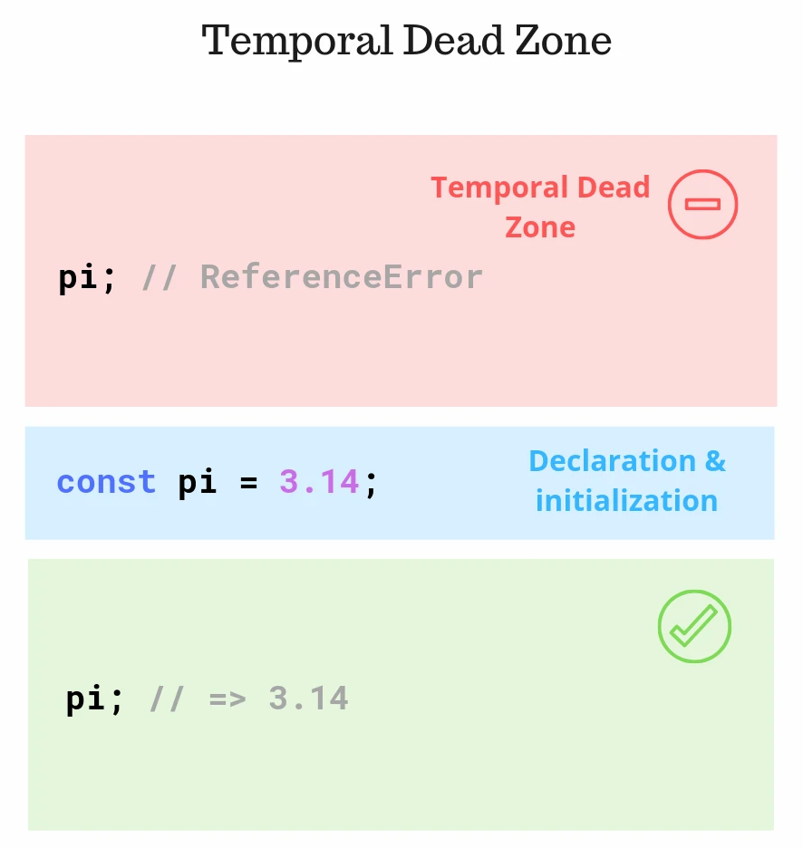

# TDZ (Temporal Dead Zone)

- 변수가 선언(variable declaration) 되기 전까지 접근할 수 없는 영역을 의미



(https://ui.toast.com/weekly-pick/ko_20191014)


## (1) TDZ 영향 여부

1. TDZ 영향 받는 경우 (접근 시 `ReferenceError` 발생)
   - const 변수
   - let 변수
   - 클래스 선언문(class declaration)
   - constructor() 내부의 super()
   - 기본 함수 매개변수(Default Function Parameter)
2. TDZ 영향 받지 않는 경우
   - var 변수 : var 변수는 선언하기 전에 접근하면, undefined
   - function 선언 : 함수는 선언된 위치와 상관없이 동일하게 호출
   - import 구문 


## (2) TDZ 예시


```javascript
function doSomething(someVal) {
  // Function scope
  typeof variable; // => undefined
  if (someVal) {
    // Inner block scope
    typeof variable; // throws `ReferenceError`
    let variable;
  }
}
doSomething(true);
```

### Reference

- [toast ui] TDZ을 모른 채 자바스크립트 변수를 사용하지 말라 : https://ui.toast.com/weekly-pick/ko_20191014
