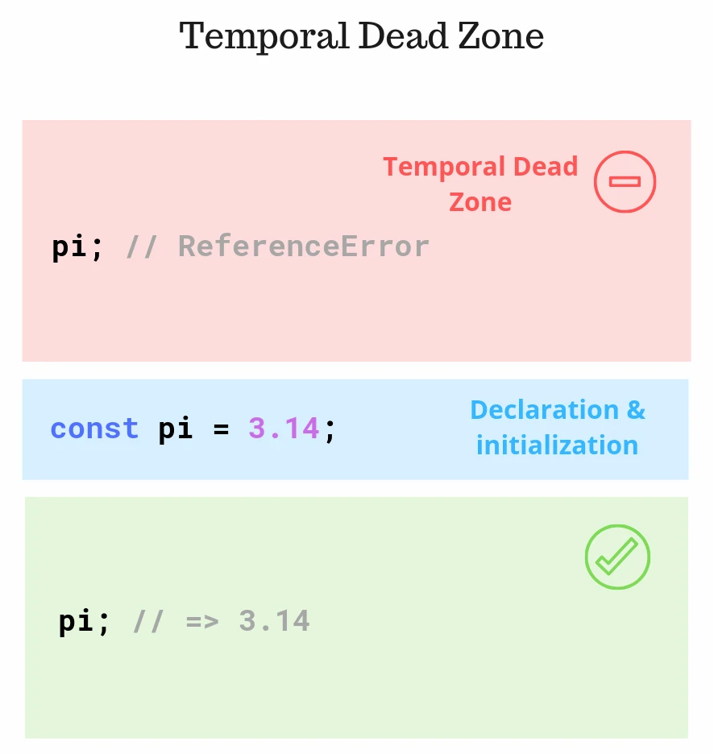
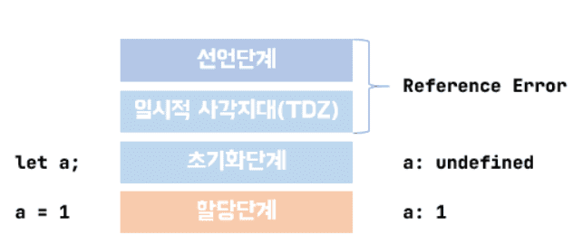

# TDZ (Temporal Dead Zone)

- 변수가 선언(variable declaration) 되기 전까지 접근할 수 없는 영역을 의미 (선언 → 초기화 → 접근)
- TDZ 에 영향을 받는 변수는 선언 이전에 참조하는 것을 금지한다. (const, let, class declaration...) 등)
- TDZ 가 JS 에서 필요한 이유는 동적 언어의 런타임 타입 체크를 지원하기 위해서이다.



(https://ui.toast.com/weekly-pick/ko_20191014)


## (1) TDZ 영향 여부

1. TDZ 영향 받는 경우 (접근 시 `ReferenceError` 발생)
   - const 변수
   - let 변수
   - 클래스 선언문(class declaration)
   - constructor() 내부의 super()
   - 기본 함수 매개변수(Default Function Parameter)
2. TDZ 영향 받지 않는 경우
   - var 변수 : var 변수는 선언하기 전에 접근하면, undefined
   - function 선언 : 함수는 선언된 위치와 상관없이 동일하게 호출
   - import 구문 

## (2) TDZ 를 통해 RuntimeError 를 반환하는 이유

1. var 는 Declaration + Initialization(undefined) 가 동시에 이루어져서 TDZ 없음. 
2. let / const / class 는 Declaration 만 먼저 되고, Initialization 전까지는 TDZ 에 걸림. 
3. const 는 Declaration + Initialization + Assignment 가 한 번에 일어나야 함.



(출처 : https://caferion.netlify.app/javascript/variable)

## (3) TDZ 예시


```javascript
function doSomething(someVal) {
  // Function scope
  typeof variable; // => undefined
  if (someVal) {
    // Inner block scope
    typeof variable; // throws `ReferenceError`
    let variable;
  }
}
doSomething(true);
```

### Reference

- [toast ui] TDZ을 모른 채 자바스크립트 변수를 사용하지 말라 : https://ui.toast.com/weekly-pick/ko_20191014
