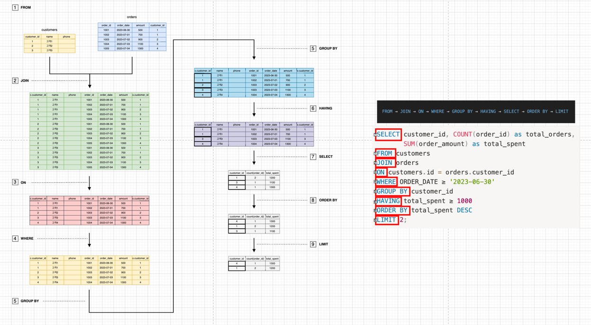

# 1. 쿼리 실행 순서

```
FROM → JOIN → ON → WHERE → GROUP BY → HAVING → SELECT → ORDER BY → LIMIT
```

1. **FROM** : 데이터를 가져올 기본 테이블(또는 뷰)을 결정.
2. **JOIN** : 결합된 테이블들 사이에서 JOIN 조건에 따라 행을 매칭
   - 기본적으로 Cartesian Product(곱집합) 을 통해 생성 
3. **ON** : JOIN 조건을 적용해 불필요한 행을 제거.
4. **WHERE** : 조건에 맞는 행만 필터링.
5. **GROUP BY**  : 남은 행들을 특정 컬럼 기준으로 그룹화 및 집계 함수 적용을 위한 묶음 생성
   - 집계 함수(SUM, COUNT, MAX 등)가 적용될 수 있도록 묶음 생성.
6. **HAVING** : GROUP BY 결과(집계된 그룹)에 조건을 적용. 
   - WHERE와 달리 집계 결과를 기준으로 필터링. 
7. **SELECT** : 최종적으로 가져올 컬럼과 집계 결과를 선택. 
   - 별칭(alias)도 이 시점에서 적용됨.
8. **ORDER BY** : SELECT 결과를 정렬. 
   - 정렬 컬럼은 SELECT에 없어도 가능(단, DBMS별 제약 존재).
9. **LIMIT / OFFSET** : 최종 결과에서 원하는 행 개수 또는 범위를 잘라냄.

> 🚨 주의사항!
> - 쿼리 실행 순서는 옵티마이저 최적화 알고리즘에 따라 다르게 동작할 수 있다.
> - 예시 : [mysql optimization](https://dev.mysql.com/doc/refman/8.0/en/optimization.html)

<br>

# 2. 쿼리 실행 순서 이미지


