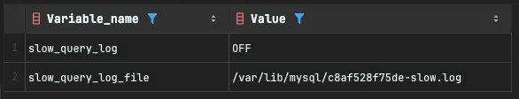
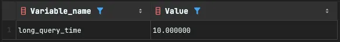

## 1. 슬로우 쿼리 환경 변수 조회 및 설정

### (1) 슬로우 쿼리 활성화 조회

- slow_query_log : 슬로우 쿼리 로그 활성화 여부 (default: OFF)
- slow_query_log_file : 슬로우 쿼리 로그 파일 경로

```sql
SHOW GLOBAL VARIABLES LIKE '%slow_query%';
```



### (2) 슬로우 쿼리 기준 설정 값 조회

- long_query_time : 슬로우 쿼리로 간주되는 실행 시간 기준 (초 단위, default: 10초)

```sql
SHOW GLOBAL VARIABLES LIKE 'long_query_time';
```



### (3) 슬로우 쿼리 활성화 및 기준 설정

```sql
SET GLOBAL slow_query_log = 'ON';
SET GLOBAL long_query_time = 1;

SELECT * FROM mysql.slow_log;
```
