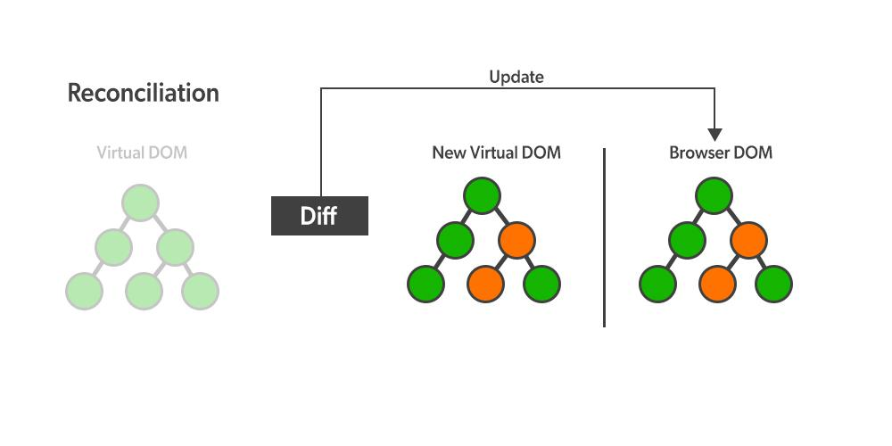

# 브라우저가 그려지는 원리와 가상돔

## 1. CRP (Critical Render Path)

브라우저가 HTML을 화면에 그리는 과정을 Critical Rendering Path라고 하며, 다음 4단계로 진행됩니다.

1. **DOM Tree 생성**: HTML을 파싱하여 DOM(Document Object Model) 트리 구조로 변환합니다.
2. **Render Tree 생성**: DOM 트리와 CSS를 결합하여 실제로 화면에 표시될 요소들만 포함한 렌더 트리를 생성합니다.
3. **Layout (Reflow)**: 각 요소의 크기와 위치를 계산하여 화면 어디에 배치할지 결정합니다.
4. **Paint**: 계산된 정보를 바탕으로 실제 픽셀을 화면에 그립니다.

## 2. CRP 과정에서의 문제점

1. **Render Tree 재생성 비용**: 사용자 인터렉션으로 DOM이 변경될 때마다 Render Tree를 처음부터 다시 생성해야 하므로 비효율적입니다.
2. **전체 요소 재계산**: DOM 일부만 변경되어도 모든 요소의 스타일 계산, Layout(Reflow), Paint 과정을 다시 수행하여 성능 저하가 발생합니다.

> 특히 SPA(Single Page Application)처럼 인터렉션이 많은 현대 웹 애플리케이션에서는 작은 변화에도 전체 렌더링 과정을 반복하므로 성능 문제가 심각해지는 문제가 발생할 수 있습니다.

## 3. 가상 돔 (Virtual DOM)

### (1) 개념
- 실제 DOM의 가벼운 복사본을 JavaScript 객체 형태로 메모리에 저장한 것입니다.

### (2) 동작 방식

1. **렌더링**: 데이터가 변경되면 새로운 Virtual DOM을 생성합니다.
2. **Diffing**: 이전 Virtual DOM과 새 Virtual DOM을 비교하여 실제로 변경된 부분만 찾아냅니다.
3. **Reconciliation(재조정)**: 변경된 부분만 실제 DOM에 반영하여 최소한의 DOM 조작으로 성능을 최적화합니다.

https://www.geeksforgeeks.org/reactjs/what-is-diffing-algorithm/

### (3) 가상 돔의 장점
1. **성능 최적화**: 변경된 부분만 실제 DOM에 반영하여 불필요한 Reflow/Repaint를 최소화합니다.
2. **배치 업데이트**: 여러 변경사항을 모아서 한 번에 DOM을 업데이트하므로 렌더링 횟수가 줄어듭니다.
3. **선언적 프로그래밍**: 개발자는 UI가 어떻게 보여야 하는지만 정의하면 되고, DOM 조작은 React가 자동으로 처리합니다.
4. **크로스 플랫폼**: Virtual DOM은 실제 DOM과 독립적이므로 React Native처럼 다른 플랫폼에서도 동일한 개념을 활용할 수 있습니다.
