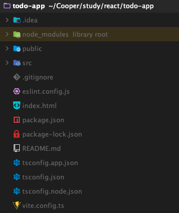

# 리액트 폴더 구조

## 1. 핵심 디렉토리

### (1) node_modules
- npm install로 설치된 모든 의존성 패키지가 저장되는 폴더로, Git에 커밋하지 않습니다.

### (2) public
- 빌드 시 그대로 복사되는 정적 파일(이미지, 폰트, favicon 등)을 저장하는 폴더입니다.

### (3) src
실제 React 애플리케이션 코드가 위치하는 메인 개발 폴더입니다.

**일반적인 src 하위 구조:**
- **components/**: 재사용 가능한 React 컴포넌트들 (Button, Header, Card 등)
- **pages/**: 페이지 단위 컴포넌트들 (Home, About, Dashboard 등)
- **hooks/**: 커스텀 훅 (useAuth, useFetch 등)
- **utils/**: 유틸리티 함수 (formatDate, validation 등)
- **assets/**: 이미지, 아이콘, 폰트 등의 리소스
- **styles/**: 전역 스타일, CSS 파일
- **App.jsx/tsx**: 최상위 컴포넌트
- **main.jsx/tsx**: 앱의 진입점, ReactDOM.render 실행

## 2. 핵심 파일

- **index.html**: React 앱의 진입점 HTML 파일로, `
`에 React가 마운트됩니다.
- **package.json**: 프로젝트 정보, 의존성 패키지 목록, 실행 스크립트(dev, build)를 정의하는 파일입니다.

## 3. 빌드 도구 설정

- **vite.config.ts**: Vite 개발 서버 포트, 플러그인, 빌드 옵션 등을 설정하는 파일입니다.
- **Vite의 역할**:
  - 개발 서버 실행 및 HMR(Hot Module Replacement) 제공
  - ES Modules 기반의 빠른 개발 환경
  - 프로덕션 빌드 시 Rollup으로 최적화된 번들 생성

> **참고**: React 앱의 실제 코드는 모두 `src/` 폴더 안에 작성하며, `public/`은 번들링되지 않는 정적 파일만 보관합니다.
