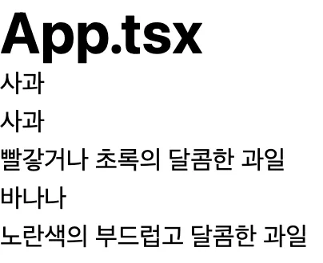
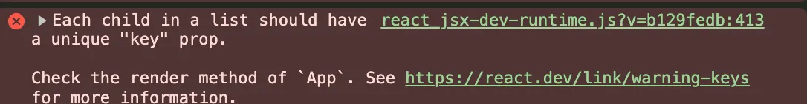
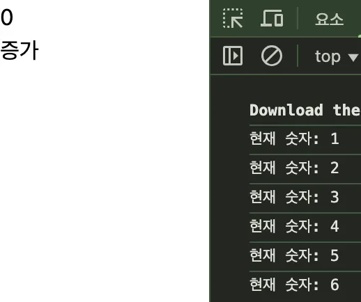
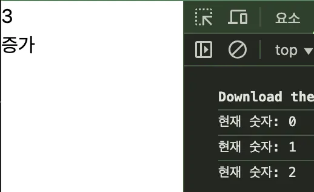
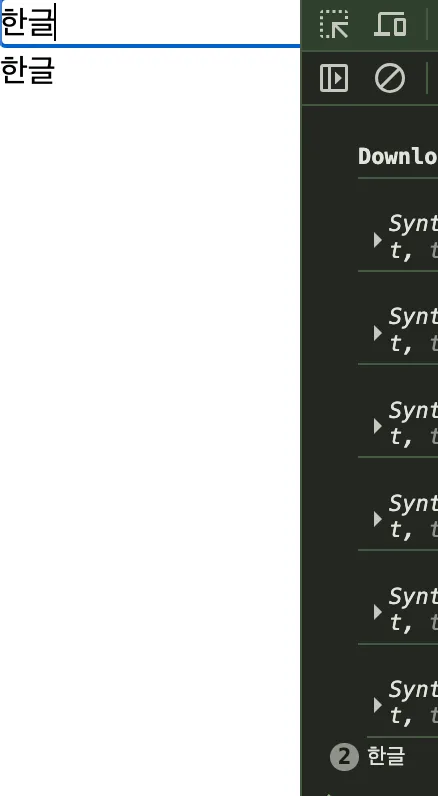
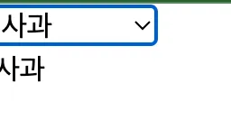

# Prerequisites

1. node js (version >= 18)
2. npm
3. vite bundler : 여러 파일을 하나의 파일로 묶어주는 도구

- [ParkYoungWoong] React 프로젝트 시작하기 : https://www.heropy.dev/p/6iFzkB#h2_%ED%85%9C%ED%94%8C%EB%A6%BF_%EC%82%AC%EC%9A%A9

```bash
# 현재 프로젝트(폴더)에 템플릿 복사
npx degit ParkYoungWoong/vite-template--react-ts .

# 패키지 설치
npm i

# 개발 서버 실행
npm run dev
```

(+ ESLint, Prettier - Code formatter plugin 설치)

<br>

# [1] 리액트 핵심 패턴 (with.TS)

## 1. Fragment

1. 하나의 리액트 컴포넌트는 하나의 컴포넌트만 반환 가능하다.
2. 만약 여러 요소로 반납하고 싶다면 `<div>` 로 묶어야 하는 번거로움이 있었다.
3. 리액트에서는  `<>` 를 특별히 제공한다.

```tsx
export default function App() {
  return (
    <>
      <header>HEADER</header>
      <main>MAIN</main>
      <footer>FOOTER</footer>
    </>
  )
}
```

## 2. 리스트 렌더링

- https://www.heropy.dev/p/QduRma#h2_%EB%A6%AC%EC%8A%A4%ED%8A%B8_%EB%A0%8C%EB%8D%94%EB%A7%81

1. 명시적 vs 암시적
    - 암시적 : 별도로 표시하지 않고 자동으로 설정됨
    - 명시적 : 별도로 표시해서 동작하도록 설정
2. FE : 사용자의 기준에서 앞에 위치하는 영역
3. client-server 는 상대적인 개념
    1. 예시
        - client : FE code(in browser)
        - server : BE (server)

### 1. {데이터} : 보간을 선언해서 데이터를 채워 넣는다.

```tsx
const fruits = [
  {
    id: 1,
    term: '사과',
    detail: '빨갛거나 초록의 달콤한 과일'
  },
  {
    id: 2,
    term: '바나나',
    detail: '노란색의 부드럽고 달콤한 과일'
  }
]

export default function App() {
  return (
    <>
      <h1 className="text-4xl font-bold">App.tsx</h1>
      <h2>{fruits[0].term}</h2>
    </>
  )
}

```


### 2. arrow function 을 통한 데이터 채우기

```tsx
const fruits = [
  {
    id: 1,
    term: '사과',
    detail: '빨갛거나 초록의 달콤한 과일'
  },
  {
    id: 2,
    term: '바나나',
    detail: '노란색의 부드럽고 달콤한 과일'
  }
]

export default function App() {
  return (
    <>
      <h1 className="text-4xl font-bold">App.tsx</h1>
      <h2>{fruits[0].term}</h2>
      <dl>
        {fruits.map(fruit => {
          return (
            <>
              <dt>{fruit.term}</dt>
              <dd>{fruit.detail}</dd>
            </>
          )
        })}
      </dl>
    </>
  )
}

```



> 🚨 하지만 에러가 발생한다?!
>

 

- 리액트는 기본적으로 값을 출력할 때 키를 기반해서 값을 반환해야 한다.
- 하지만 속성은 태그 이름이 존재해야 하므로 `<>`  를 사용할 수 없다.
- 이를 해결하기 위해서 `Framgment component` 를 제공해야 한다.

## 3. {} : 데이터 보간

### 1. 데이터 보간 베이직

- 컴포넌트 템플릿에서 `{}` 기호를 사용해 데이터를 채워서 출력할 수 있다.
- 이를 보간법(interpolation) 이라 부른다.

```tsx
export default function App() {
  const name = 'ParkYoungWoong'

  return (
    <h1>Hello, {name}!</h1>
  )
}
```

- 템플릿 {} 기호 사이에는 간단한 `표현식(expression)` 을 사용할 수 있다.
- 구문(statement) 는 불가 : if, case, switch…

```tsx
export default function App() {
  const count = 1

  function getFullName(firstName: string, lastName: string) {
    return `${firstName} ${lastName}`
  }

  return (
    <>
      <h2>{count + 7}</h2> // 이 부분
      <h2>{getFullName('YoungWoong', 'Park')}</h2>
    </>
  )
}
```

### 2. 데이터 상태 변경하지만 화면은 출력되지 않는다?

```tsx
export default function App() {
  let count = 0
  return (
    <>
      <h1>{count}</h1>
      <button
        onClick={() => {
          count += 1
          console.log('현재 숫자: ' + count)
        }}>
        증가
      </button>
    </>
  )
}

```



## 4. useState: 데이터 상태를 화면에 반영하자.

### (1)  useState 를 사용해서 상태를 변경하자.

- React 역할 : 데이터에만 신경쓰고 출력은 리액트가 담당해주는 역할
- React 는 반응형 웹을 제공해주는 역할을 한다.

```tsx
// const[Getter, Setter] = useState(초기값)
const [count, setCount] = useState(0)
```

```tsx
import { useState } from 'react'

export default function App() {
  // JS 구조 분해 할당 문법
  // const[Getter, Setter] = useState(초기값)
  const [count, setCount] = useState(0)
  return (
    <>
      <h1>{count}</h1>
      <button
        onClick={() => {
          setCount(count + 1)
          console.log('현재 숫자: ' + count)
        }}>
        증가
      </button>
    </>
  )
}
```



> **❓결과 값과 console 값이 이전 값으로 출력되는 이유??**
>
- `setCount(count + 1)`는 상태 업데이트를 예약하는 함수일 뿐, **즉시 `count` 값을 변경하지 않는다.**
- 그래서 그 다음 줄의 `console.log('현재 숫자: ' + count)`에서는 **이전 값**이 그대로 출력된다.

### (2) 값이 변경될 때마다 값을 반영하도록 하자.

- 한쪽 반향으로만 값을 조회하는 방식 : 단방향 데이터 바인딩
- 값을 조회하고 그 값을 업데이트하는 방식 : 양방향 데이터 바인딩

```tsx
import { useState } from 'react'

export default function App() {
  const [text, setText] = useState('')
  return (
    <>
      <input
        value={text}
        onChange={event => {
          setText(event.target.value)
        }}
      />

      <h1>{text}</h1>
    </>
  )
}
```


- ‘가나다라’ 를 입력하는 순서대로 ‘가나다라’ 로 반영된다.
- **하지만 만약 많은 코드를 입력해야 하면 HTML 에 커지면 디버깅과 같은 유지보수가 어렵기 때문에 function 을 만들어서 연결하는 방식이 효율적이다.**

> input tag basic
>
- onChange : 값이 변경될 때마다 값을 반영한다.

### (3) function 을 통해서 코드 분리

1. 파라미터 타입 설명
    1. &lt;input&gt; element 에 onChangeEvent 으로 타입을 선언하고
    2. 이벤트를 전달받아 값을 변경
2. function 선언 및

```tsx
// 파라미터
function handleChange(event: React.ChangeEvent<HTMLInputElement>) {
  setText(event.target.value)
}
```

```tsx
import React, { useState } from 'react'

export default function App() {
  const [text, setText] = useState('')
  
  function handleChange(event: React.ChangeEvent<HTMLInputElement>) {
    setText(event.target.value)
  }

  return (
    <>
      <input
        value={text}
        onChange={handleChange}
      />

      <h1>{text}</h1>
    </>
  )
}

```


- 해당 내용을 통해서 타입 구분이 가능하자.

### (4) keyboard enter 도 이벤트를 받아서 확인해보자.

```tsx
import React, { useState } from 'react'

export default function App() {
  const [text, setText] = useState('')

  function handleChange(event: React.ChangeEvent<HTMLInputElement>) {
    console.log(event)
    setText(event.target.value)
  }

  function handleKeydown(event: React.KeyboardEvent<HTMLInputElement>) {
    if (event.key === 'Enter') {
      console.log(text)
    }
  }

  return (
    <>
      <input
        value={text}
        onChange={handleChange}
        onKeyDown={handleKeydown}
      />
      <h1>{text}</h1>
    </>
  )
}

```

### (5) 한글로 입력하면 keyboard 가 두번 처리된다??

1. 처리 중O 과 처리 중X 이 동시에 호출하기 때문에 발생



### (6) 해결 방법 : nativeEvent 사용하기

```tsx
 import React, { useState } from 'react'

export default function App() {
  const [text, setText] = useState('')

  function handleChange(event: React.ChangeEvent<HTMLInputElement>) {
    console.log(event)
    setText(event.target.value)
  }

  function handleKeydown(event: React.KeyboardEvent<HTMLInputElement>) {
    if (event.key === 'Enter' && !event.nativeEvent.isComposing) {
      console.log(text)
    }
  }

  return (
    <>
      <input
        value={text}
        onChange={handleChange}
        onKeyDown={handleKeydown}
      />
      <h1>{text}</h1>
    </>
  )
}

```

## 5. className 사용해서 css 를 동적으로 사용하기

### (1) 리액트는 class 속성 대신 className 을 사용한다.

```jsx
import React, { useState } from 'react'
import styles from './App.module.css'

export default function App() {
  const [text, setText] = useState('안녕하세요')
  const [isActive, setIsActive] = useState(false)

  return (
    <>
      <input
        value={text}
      />
      <h1
        className={`title ${isActive ? styles.active : ''}`} // 텍스트 클릭하면 빨간 색을 활성화, 비활성화가 가능하다.
        onClick={() => {
          setIsActive(!isActive)
        }}>
        {text}
      </h1>
    </>
  )
}
 
```

### (2) 동적으로 css 를 추가, 제거하기 위해서는 react styles 문법을 사용할 수 있다.

- 로직은 JS code 를 통해서 사용하고,
- styles 값 대입은 js 문법(``${}``)을 활용해서 적용한다.

1. src 하위에 App.module.css 추가

```css
.active {
  color: red;
}

```

1. JS `${value}` 를 사용해서 CSS 추가, 제거하기

```tsx
import React, { useState } from 'react'
import styles from './App.module.css'

export default function App() {
  const [text, setText] = useState('안녕하세요')
  const [isActive, setIsActive] = useState(false)

  function handleChange(event: React.ChangeEvent<HTMLInputElement>) {
    console.log(event)
    setText(event.target.value)
  }

  function handleKeydown(event: React.KeyboardEvent<HTMLInputElement>) {
    if (event.key === 'Enter' && !event.nativeEvent.isComposing) {
      console.log(text)
    }
  }

  return (
    <>
      <input
        value={text}
        onChange={handleChange}
        onKeyDown={handleKeydown}
      />
      <h1
        className={`title ${isActive ? styles.active : ''}`} // 텍스트 클릭하면 빨간 색을 활성화, 비활성화가 가능하다.
        onClick={() => {
          setIsActive(!isActive)
        }}>
        {text}
      </h1>
    </>
  )
}
 
```

### (3) css 값은 style 속성을 활용하고 객체 형태로 관리가 가능하다. (기존 문자열 지원X + 추천하지는 않음)

- 정적인 요소 : App.module.css 파일을 활용해서 className 으로 추가하자.
- 동적인 요소 : JS 를 활용해서 핸들링 하도록 하자.
    - 클릭마다 글자 크기 조절

```css
.active {
  color: red;
}

.title {
  background-color: blue;
  color: white;
}
```

```tsx
import { useState } from 'react'
import styles from './App.module.css'

export default function App() {
  const [text, setText] = useState('안녕하세요')
  const [isActive, setIsActive] = useState(false)
  const [width, setWidth] = useState(200)

  function handleChange(event: React.ChangeEvent<HTMLInputElement>) {
    console.log(event)
    setText(event.target.value)
  }

  function handleKeydown(event: React.KeyboardEvent<HTMLInputElement>) {
    if (event.key === 'Enter' && !event.nativeEvent.isComposing) {
      console.log(text)
    }
  }

  return (
    <>
      <input
        value={text}
        onChange={handleChange}
        onKeyDown={handleKeydown}
      />
      <h1
        className={`${styles.title} ${isActive ? styles.active : ''}`}
        style={{
          width: `${width}px`
        }}
        onClick={() => {
          setIsActive(!isActive)
          setWidth(width + 20)
        }}>
        {text}
      </h1>
    </>
  )
}

```

## 6. 조건부 렌더링

### (1) 논리 연산자

1. JS 에서 빈 문자열은 `false` 이다.
2. trim 메서드는 값이 존재 유무를 확인하는 방법이다?

    ```jsx
      const str = "  Hello, world!  ";
      const newStr = str.trim(); // newStr은 "Hello, world!"가 됩니다.
      console.log(str); // "  Hello, world!  " (원래 문자열은 그대로)
      console.log(newStr); // "Hello, world!"
    ```


```tsx
import { useState } from 'react'

export default function App() {
  const [message, setMessage] = useState('')

  return (
    <>
      <input
        value={message}
        onChange={e => setMessage(e.target.value)}
      />
      {message.trim() && <div>입력된 내용이 있어요~</div>}
    </>
  )
}

```

### (2) 삼항 연산자

- 토글 버튼 누를 때 사용
- boolean 타입의 보간된 데이터는 출력이 안된다.
    - 그러므로 string or number 로 출력해야 한다.

```jsx
import { useState } from 'react'

export default function App() {
  const [isActive, setIsActive] = useState(false)

  function toggle() {
    setIsActive(!isActive)
  }

  return (
    <>
      {isActive ? (
        <h1>활성화 - {String(isActive)}</h1>
      ) : (
        <h1>비활성화 - {String(isActive)}</h1>
      )}
      <button onClick={toggle}>토글</button>
    </>
  )
}

```

### (3) 더 복잡한 조건

- 상태를 넘겨서 그에 맞는 출력 형태만 변경하는 경우에 많이 사용
1. 로직 흐름
    1. 버튼 클릭 시 `setState()`  를 통해 값 변경
    2. 변경된 state 을 renderStateMessage function 에서 값을 전달받아 다른 문자를 렌더링 (상태 값에 따라 UI 출력이 동적으로 바뀜)

```jsx
import { useState } from 'react'

export default function App() {
  const [state, setState] = useState('')

  function renderStateMessage() {
    if (state === 'loading') {
      return <h2>로딩 중입니다.</h2>
    } else if (state === 'success') {
      return <h2>성공적으로 완료되었습니다.</h2>
    } else {
      return <h2>대기 중입니다.</h2>
    }
  }

  return (
    <>
      <button onClick={() => setState('loading')}>
        로딩!
      </button>
      <button onClick={() => setState('success')}>
        성공!
      </button>
      {renderStateMessage()}
    </>
  )
}
```

> 📌 JS 배열 TMI
>
1. JS 는 배열의 사이즈를 조절할 수 있는 방법이 없다.
2. 배열은 갯수과 관계없이 처리할 수 있는 방식이 정해져 있다.
    - forEach, map 과 방식을 통해서 처리한다.
3. 문자 데이터 타입

    ```jsx
     const s1 = "hello"; // 큰 따옴표
     const s2 = "world"; // 작은 따옴표
     const s3 = `${s1} ${s2}`; // 템플릿 리터럴
     const s4 = s1 + ' ' + s2;
    ```


> 📌 react 문법
>
- return 에서 최상위 태그의 키 속성은 필수다!
- useXXX 로 구성된 메서드는 `훅(hook)` 이라 부른다.

```tsx
export default function App() {
  const fruits = ['사과', '바나나', '체리']
  const renderFruits = fruits.map((fruit, index) => (
    <li key={index}>{fruit}</li> // 여기!
  ))

  return (
    <>
      <h1>과일 리스트</h1>
      <ul>{renderFruits}</ul>
    </>
  )
}

```

## 7. 리스트 데이터의 변화에 따라 렌더링 처리

- 리스트를 반응형 데이터로 변경하고 이를 감지해서 리액트가 렌더링 하도록 구성하기
- 리스트 데이터는 기존 데이터에서 덮어쓰기 방식으로 동작한다.

`version01 : 함수 선언 케이스`

```tsx
import { useState, useMemo, useEffect } from 'react'

export default function App() {
  const [fruits, setFruits] = useState(['사과', '바나나', '체리'])
  const renderFruits = fruits.map((fruit, index) => (
    <li key={index}>{fruit}</li>
  ))

  return (
    <>
      <h1
        onClick={() => {
          setFruits([...fruits, '오렌지']) // 전개 연산자(spread operator)
        }}>
        과일 리스트
      </h1>
      <ul>{renderFruits}</ul>
    </>
  )
}
```

`version02 : 변수 선언 제거

```tsx
import { useState, useMemo, useEffect } from 'react'

export default function App() {
  const [fruits, setFruits] = useState(['사과', '바나나', '체리'])

  return (
    <>
      <h1
        onClick={() => {
          setFruits([...fruits, '오렌지']) // 전개 연산자(spread operator)
        }}>
        과일 리스트
      </h1>
      <ul>
        {fruits.map((fruit, index) => (
          <li key={index}>{fruit}</li>
        ))}
      </ul>
    </>
  )
}

```

> 📌JS 배열 TMI
>

1. 전개 연산자는 얕은 복사(shallow copy) 이다.
    - 객체 참조는 유지한다. (↔ 깊은 복사는 새로운 객체에 값을 복사)

    ```tsx
    // 일반 배열 케이스
    
    const f1 = ['사과', '바나나', '체리']
    
    /* 앞에 배열에서 [] 를 제거해서 하나의 배열로 만들어줘 */
    const f2 = [...f1, '오렌지']
    const f2 = [...['사과', '바나나', '체리'], '오렌지']
    ```

    ```tsx
    // 객체 데이터 케이스
    
    const o1 = {a: 1, b: 2}
    
    const o2 = {...o1, c: 3}
    const o2 = {a:1, b: 2, c: 3}
    ```

2. **console.log()** 리턴 타입은 `undefined` 이다.

## 8.  계산된 데이터 : useMemo()

- [https://www.heropy.dev/p/QduRma#h2_계산된_데이터](https://www.heropy.dev/p/QduRma#h2_%EA%B3%84%EC%82%B0%EB%90%9C_%EB%8D%B0%EC%9D%B4%ED%84%B0)

`useMemo`

- **데이터가 변경될 때 그것을 기반으로 자동 계산되어(Computed) 업데이트되는 별도의 데이터를 만들 수 있다.**
- **(기반 데이터는 `반응형`이어야 한다!)**

```tsx
import { useMemo } from 'react'

// 계산된 데이터 선언
const 계산된데이터 = useMemo(() => 새로운값, [기반데이터])
```

sample code

- useMemo(실행할 함수, 의존성배열)

```tsx
import { useState, useMemo } from 'react'

export default function App() {
  const [count, setCount] = useState(0)
  const double = useMemo(() => count * 2, [count])

  return (
    <>
      <h1>count: {count}</h1>
      <h2>double: {double}</h2>
      <button onClick={() => setCount(count + 1)}>증가</button>
    </>
  )
}
```

## 9.  데이터 감시 : useEffect()

1. `useEffect()` : **그것을 감시(Watch)하여 자동으로 실행되는 함수(콜백)**이다.
2. **🚨 useMemo() vs useEffect()**
    1. useMemo() 은 데이터에 반응해 새로운 데이터를 만드는 것이 목적이다.
    2. useEffect() 은 데이터에 반응해 다른 함수 호출이 자체가 궁극적인 목표이다.

```tsx
import { useEffect } from 'react'

// 데이터 감시 선언
useEffect(실행할함수, [감시할데이터])
```

```tsx
import { useState, useEffect } from 'react'

export default function App() {
  const [count, setCount] = useState(0)

  useEffect(() => {
    console.log('count 값이 변경되었습니다:', count)
  }, [count])

  return (
    <>
      <h1>카운트: {count}</h1>
      <button onClick={() => setCount(count + 1)}>증가</button>
    </>
  )
}
```

## 10. 양식 입력 바인딩

- 텍스트가 변경되는 이벤트를 받아 text 상태를 변경하는 방식 (양방향 바인딩)

```tsx
import { useState } from 'react'

export default function App() {
  const [text, setText] = useState('')

  return (
    <>
      <input
        value={text}
        onChange={e => setText(e.target.value)}
      />
      <h2>{text}</h2>
    </>
  )
}
```

## 11. 단일 체크박스

1. 체크박스의 이벤트의 checked 변경 값을 상태에 반영하는 방식을 말한다.

   (양방향 바인딩)


```tsx
import { useState } from 'react'

export default function App() {
  const [checked, setChecked] = useState(false)

  return (
    <>
      <label>
        <input
          type="checkbox"
          checked={checked}
          onChange={e => setChecked(e.target.checked)}
        />
        동의합니다.
      </label>
      <h2>동의 여부: {checked ? '예' : '아니오'}</h2>
    </>
  )
}
```

## 12. 셀렉트 박스: 단일 선택

```tsx
import { useState } from 'react'

const fruits = ['사과', '바나나', '체리', '딸기']

export default function App() {
  const [selected, setSelected] = useState('')

  return (
    <>
      <select
        value={selected}
        onChange={e => setSelected(e.target.value)}>
        <option value="">선택하세요</option>
        {fruits.map(fruit => (
          <option
            key={fruit}
            value={fruit}>
            {fruit}
          </option>
        ))}
      </select>
      <h2>{selected}</h2>
    </>
  )
}
```



# [3] 템플릿(요소) 참조

- querySelector 를 통해서 연결하지 말고, 바로바로 사용하자. 다만 current 속성을 사용해야 한다.

1. querySelector vs useRef
    1. querySelector : 검색해서 조회하는 경우
    2. useRef : 참조해서 조회하는 경우

`적용 전` : querySelector 를 사용하는 경우

```tsx
export default function App() {
  function handleClick() {
    const input = document.querySelector(
      'input.boarder-gray-500'
    ) as HTMLInputElement | null
    input?.focus()
  }

  return (
    <>
      <input className="boarder-gray-500" />
      <button onClick={handleClick}>포커스!</button>
    </>
  )
}

```

`적용 후` : useRef 를 사용하는 경우

```tsx
import { useRef } from 'react'

export default function App() {
  const inputRef = useRef<HTMLInputElement>(null)

  return (
    <>
      <input
        ref={inputRef}
        className="boarder-gray-500"
      />
      <button onClick={() => inputRef.current?.focus()}>포커스!</button>
    </>
  )
}

```

div 를 묶어서 사용하는 경우도 있다.

```tsx
import { useRef } from 'react'

export default function App() {
  const inputRef = useRef<HTMLInputElement>(null)
  const divRef = useRef<HTMLDivElement>(null)

  return (
    <>
      <div ref={divRef}>
        <input
          ref={inputRef}
          className="boarder-gray-500"
        />
        <button onClick={() => inputRef.current?.focus()}>포커스!</button>
      </div>
    </>
  )
}

```

> 📌 JS 배열 TMI
>

1. `?.` : optional chaining

```tsx
const obj = {
	name: 'John',
	age: 22
}

// 없는 속성을 undefined 로 취급하고 인덱싱할 수 없어 에러
console.log(obj.emails[0])

// ? 은 다음 값에 속성이 존재하면 접근하고, 아닐 경우 접근하지 않는 경우
// 흐름 obj -> email(undefined) -> [0] 호출X -> 에러 반환 안함
console.log(obj?.emails?[0])
```

> FE 개발자의 레이아웃 구분 영역??
>
1. header
2. navbar
3. main

- https://developer.mozilla.org/ko/docs/Learn_web_development/Core/CSS_layout/Introduction
- CSS 기본도 모르면 FE 가 맞는가..?

> semantic tag ??
>
- 의미만가지고 있는 태그
- <div>, <header>, <main>, <nav>

### Q. 화면이 올라가자마자 포커스를 하도록 하는 방법

- `useEffect(() => {}, [])`  는 화면이 출력되자마자 1회 실행된다.

`좋은 예`

```tsx
import { useEffect, useRef } from 'react'

export default function App() {
  const inputRef = useRef<HTMLInputElement>(null)
  useEffect(() => {
    inputRef.current?.focus()
  }, [])

  return (
    <>
      <input
        ref={inputRef}
        className="boarder-gray-500"
      />
      <button onClick={() => inputRef.current?.focus()}>포커스!</button>
    </>
  )
}

```

`이렇게 하면 동작 안함.`

```tsx
import { useEffect, useRef } from 'react'

export default function App() {
  const inputRef = useRef<HTMLInputElement>(null)
  inputRef.current?.focus() // null 에서는 optional chaining 을 지원하지 않으므로 아래 코드가 실행되지도 않는다.

  return (
    <>
      <input
        ref={inputRef}
        className="boarder-gray-500"
      />
      <button onClick={() => inputRef.current?.focus()}>포커스!</button>
    </>
  )
}

```

# [4] 컴포넌트

- `<>` 이름 : 프래그먼트

```tsx
<button onClick={searchMovies}>검색!</button> // onClick 하면 실행
<button onClick={searchMovies()}>검색!</button> // 바로 실행

```

- `@` 를 사용하면 root 로 설정된 값을 사용할 수 있다. (경로 별칭)
- `vite.config.ts` 에서 확인 가능

```tsx
import { defineConfig } from 'vite'
import react from '@vitejs/plugin-react'
import tailwindcss from '@tailwindcss/vite'

// https://vitejs.dev/config/
export default defineConfig({
  plugins: [react(), tailwindcss()],
  resolve: {
    alias: [{ find: '@', replacement: '/src' }]
  }
})

```

### (2) API call 응답받기

- https://transform.tools/json-to-typescript
- Movie 를 선언하는 이유 : 타입 에러 방지

```tsx
import { useState } from 'react'

// 데이터 타입 설정 (by. transform)
export interface Movie {
  Title: string
  Year: string
  imdbID: string
  Type: string
  Poster: string
}

export default function SearchBar() {
  const [searchText, setSearchText] = useState('')
  const [movies, setMovies] = useState<Movie[]>([]) // 선언한 데이터 타입 제네릭 설정

  async function searchMovies() {
    console.log(`${searchText}`)
    const res = await fetch(
      `https://omdbapi.com?apikey=7035c60c&s=${searchText}`
    )
    const data = await res.json()
    console.log(data.Search)
    setMovies(data.Search)
  }

  return (
    <>
      <input
        type="text"
        value={searchText}
        onChange={e => {
          setSearchText(e.target.value)
        }}
        onKeyDown={e => {
          if (e.key == 'Enter' && !e.nativeEvent.isComposing) {
            searchMovies()
          }
        }}
      />
      <button onClick={searchMovies}>검색!</button>
      <ul>
        {movies.map(movie => {
          return <li>{movie.Title}</li>
        })}
      </ul>
    </>
  )
}

```

# [5] 중앙 집중화된 상태 관리: zustand

## (1) installation

```bash
npm i zustand
```

## (2) 파일 생성

- 문법

```tsx
create(
	combine(데이터들, 실행할 함수들)
)
```

- stores/movie.ts

```tsx
import { create } from 'zustand'
import { combine } from 'zustand/middleware' // 타입 추론하기 위함

export interface Movie {
  Title: string
  Year: string
  imdbID: string
  Type: string
  Poster: string
}

create(
  combine({ movies: [] as Movie[] }, () => {
    return {}
  })
)

```

props : 컴포넌트에게 객체를 전달하는 방식

```tsx
export default function App() {
  const [message, setMessage] = useState('111')

  return (
    <>
      <SearchBar />
      <MovieList
        msg={message}
        total={10}
        onClick={() => setMessage('안녕하세요!')}
        abc={123}
      />
    </>
  )
}

```

```tsx
import { useMovieStore } from '@/stores/movie'

export default function MovieList({
  msg,
  total,
  onClick,
  ...props // rest
}: {
  msg: string
  total: number
  onClick: () => void
}) {
  const movies = useMovieStore(state => state.movies)

  return (
    <>
      <h2 onClick={onClick}>{msg}</h2>
      <h3> 최대 {...props}개 영화까지 검색됩니다.</h3>
      <ul>
        {movies.map(movie => {
          return (
            <li key={movie.imdbID}>
              <div>{movie.Title}</div>
              
            </li>
          )
        })}
      </ul>
    </>
  )
}

```

## (3) 슬롯(slot)

- `요소` + `주석` + `글자`  는 모두 노드이다. (각자 모두 객체이다.)
- children 은 모든 노드가 될 수 있다. ⇒ `요소` + `주석` + `글자`

```html
<Button>
<!-- 노드들이 넘겨질 수 있다. -->
<!-- 노드는 요소 + 주석 + 글자로 구성된다. -->
  버튼입니다.
  <Component></Component>
</Button>

```

```tsx
import React from 'react'

export default function Button({ children }: { childer: React.ReactNode }) {
  return (
    <div>
      <label>버튼입니다!</label>
      <button>{children}</button>
    </div>
  )
}

```

# Reference

- Kernel360 백엔드 캠프 리액트 특강 : https://curse-battery-d1c.notion.site/25-05-Kernel360-1e6c672eb95e80998774e743fec83896
- vite : https://ko.vite.dev/guide/
