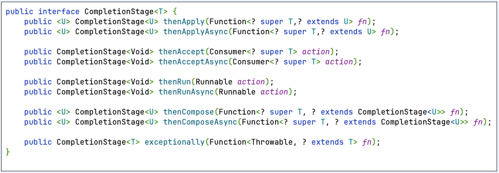

# CompletableStage interface



1. CompletableStage 연산자 조합 장점??
   1. 체이닝을 통해 비동기 태스크를 실행 및 조합이 가능하다.
   2. 에러 처리를 위한 콜백 함수 제공

## CompletableStage 연산자연산자와 연결

### 1. thenAccept(Consumer action)
1. 다음 태스크에게 null 을 반환 (리턴타입이 void)
2. 값을 받아서 action 만 수행하는 경우 유용
3. thenAccept vs thenAcceptAsync
   - thenAccept : 현재 쓰레드(caller) 에서 실행 (**🚨 caller thread 를 블록할 수 있다!**)
   - thenAcceptAsync : thread pool 스레드에서 실행

```kotlin
import org.slf4j.LoggerFactory
import java.util.concurrent.CompletableFuture
import java.util.concurrent.CompletionStage

private val log = LoggerFactory.getLogger("Helper")

object Helper {
    fun finishedStage(): CompletionStage<Int> {
        val future = CompletableFuture.supplyAsync {
            log.info("return in future")
            1
        }
        Thread.sleep(100)
        return future
    }
}
```

<br>

`CompletionStageThenAcceptExample`
1. done 상태인 경우
   - done 상태인 thenAccept 는 caller(main) 에서 실행된다.
   - done 상태인 completionStage 에서 thenAccept 를 호출하면 **caller 스레드를 블록할 수 있다.** (상위 작업이 대기)
2. done 상태가 아닌 경우
   - done 상태가 아닌 thenAccept 는 callee(forkJoinPool) 에서 실행된다.
   - done 상태가 아닌 completionStage 에서 thenAccept 를 호출하면 **callee 는 블록될 수 있다.** (하위 작업이 대기)

```kotlin
import org.slf4j.LoggerFactory

fun main() {
    val log = LoggerFactory.getLogger("CompletionStageThenAcceptExample")
    log.info("start main")

    val stage = Helper.finishedStage()
    
    stage.thenAccept { i ->
        log.info("$i in thenAcceptAsync")
    }.thenAccept { i ->
        log.info("$i in thenAcceptAsync2")
    }
    log.info("after thenAccept")

    Thread.sleep(100)
}
```

```
[main] INFO CompletionStageThenAcceptExample -- start main
[ForkJoinPool.commonPool-worker-1] INFO Helper -- return in future
[main] INFO CompletionStageThenAcceptExample -- 1 in thenAcceptAsync
[main] INFO CompletionStageThenAcceptExample -- null in thenAcceptAsync2
[main] INFO CompletionStageThenAcceptExample -- after thenAccept
```

<br>

`CompletionStageThenAcceptAsyncExample`

```kotlin
import org.slf4j.LoggerFactory

fun main() {
    val log = LoggerFactory.getLogger("CompletionStageThenAcceptAsyncExample")
    log.info("start main")

    val stage = Helper.finishedStage()
    
    stage.thenAcceptAsync { i ->
        log.info("$i in thenAcceptAsync")
    }.thenAcceptAsync { i ->
        log.info("$i in thenAcceptAsync2")
    }
    log.info("after thenAccept")

    Thread.sleep(100)
}
```

```
[main] INFO CompletionStageThenAcceptAsyncExample -- start main
[ForkJoinPool.commonPool-worker-1] INFO Helper -- return in future
[main] INFO CompletionStageThenAcceptAsyncExample -- 1 in thenAcceptAsync
[main] INFO CompletionStageThenAcceptAsyncExample -- null in thenAcceptAsync2
[main] INFO CompletionStageThenAcceptAsyncExample -- after thenAccept
```

### 3. then*Async 스레드 풀 변경

```kotlin
import org.slf4j.LoggerFactory
import java.util.concurrent.Executors

fun main() {
    val log = LoggerFactory.getLogger("CompletionStageThenAcceptAsyncExecutorExample")

    val single = Executors.newSingleThreadExecutor()
    val fixed = Executors.newFixedThreadPool(10)

    log.info("start main")
    val stage = Helper.completionStage()
    stage.thenAcceptAsync({ i ->
        log.info("$i in thenAcceptAsync")
    }, fixed).thenAcceptAsync({ i ->
        log.info("$i in thenAcceptAsync2")
    }, single)
    log.info("after thenAccept")
    Thread.sleep(200)

    single.shutdown()
    fixed.shutdown()
}
```

```
15:07:51.381 [main] INFO CompletionStageThenAcceptAsyncExecutorExample -- start main
15:07:51.388 [ForkJoinPool.commonPool-worker-1] INFO Helper -- return in future
15:07:51.391 [main] INFO CompletionStageThenAcceptAsyncExecutorExample -- after thenAccept
15:07:51.391 [pool-2-thread-1] INFO CompletionStageThenAcceptAsyncExecutorExample -- 1 in thenAcceptAsync
15:07:51.392 [pool-1-thread-1] INFO CompletionStageThenAcceptAsyncExecutorExample -- null in thenAcceptAsync2
```

### 2. thenApply(Function fn)

1. 이전 태스크로부터 T 타입의 값을 받아서 가공하고 U 타입의 값을 반환한다. (다음 태스크에게 반환했던 값이 전달된다)
2. thenCompose 와의 차이점
   - thenApply : 결과를 변환
   - thenCompose : 결과를 이용해서 새로운 작업을 실행

```kotlin
import org.slf4j.LoggerFactory

fun main() {
    val log = LoggerFactory.getLogger("CompletionStageThenApplyAsyncExample")
    val stage = Helper.completionStage()

    stage.thenApplyAsync { value ->
        val next = value + 1
        log.info("in thenApplyAsync: {}", next)
        next
    }.thenApplyAsync { value ->
        val next = "result: $value"
        log.info("in thenApplyAsync2: {}", next)
        next
    }.thenApplyAsync { value ->
        val next = value == "result: 2"
        log.info("in thenApplyAsync3: {}", next)
        next
    }.thenAcceptAsync { value ->
        log.info("{}", value)
    }

    Thread.sleep(100)
}
```

- thenApply 콘솔
```
[ForkJoinPool.commonPool-worker-1] INFO Helper -- return in future
[main] INFO CompletionStageThenApplyExample -- task start
[main] INFO CompletionStageThenApplyExample -- in thenApplyAsync: 2
[main] INFO CompletionStageThenApplyExample -- in thenApplyAsync2: result: 2
[main] INFO CompletionStageThenApplyExample -- in thenApplyAsync3: true
[main] INFO CompletionStageThenApplyExample -- true
[main] INFO CompletionStageThenApplyExample -- task end
```

- thenApplyAsync 콘솔
```
[main] INFO CompletionStageThenApplyAsyncExample -- task start
[ForkJoinPool.commonPool-worker-1] INFO Helper -- return in future
[ForkJoinPool.commonPool-worker-1] INFO CompletionStageThenApplyAsyncExample -- in thenApplyAsync: 2
[ForkJoinPool.commonPool-worker-2] INFO CompletionStageThenApplyAsyncExample -- in thenApplyAsync2: result: 2
[ForkJoinPool.commonPool-worker-2] INFO CompletionStageThenApplyAsyncExample -- in thenApplyAsync3: true
[main] INFO CompletionStageThenApplyAsyncExample -- task end
[ForkJoinPool.commonPool-worker-2] INFO CompletionStageThenApplyAsyncExample -- true
``` 

### 3. thenCompose(Function fn)

1. 이전 태스크로 부터 T 타입의 값을 받아서 가공하고 U 타입의 CompletionStage를 반환한다 (📌 결과를 이용해서 새로운 작업 실행)
2. 반환한 CompletionStage가 done 상태가 되면 값을 다음 task에 전달한다
3. 다른 future를 반환해야하는 경우 유용

```kotlin
object Helper {
    fun addOne(value: Int): CompletionStage<Int> =
        CompletableFuture.supplyAsync {
            try {
                Thread.sleep(100)
            } catch (e: InterruptedException) {
                throw RuntimeException(e)
            }
            value + 1
        }

   fun addResultPrefix(value: Int): CompletionStage<String> =
      CompletableFuture.supplyAsync {
         try {
            Thread.sleep(100)
         } catch (e: InterruptedException) {
            throw RuntimeException(e)
         }
         "result: $value"
      }
}
```

```kotlin
fun main() {
   val log = LoggerFactory.getLogger("CompletionStageThenComposeAsyncExample")
   log.info("start main")
   val stage = Helper.completionStage()
   stage.thenComposeAsync { value ->
      val next = Helper.addOne(value)
      log.info("in thenComposeAsync: {}", next)
      next
   }.thenComposeAsync { value ->
      val next = Helper.addResultPrefix(value)
      log.info("in thenComposeAsync2: {}", next)
      next
   }.thenAcceptAsync { value ->
      log.info("{} in thenAcceptAsync", value)
   }

   Thread.sleep(1000)
   log.info("end main")
}
```

```
[main] INFO CompletionStageThenComposeAsyncExample -- start main
[ForkJoinPool.commonPool-worker-1] INFO Helper -- return in future
[ForkJoinPool.commonPool-worker-1] INFO CompletionStageThenComposeAsyncExample -- in thenComposeAsync: java.util.concurrent.CompletableFuture@8cfced8[Not completed]
[ForkJoinPool.commonPool-worker-1] INFO CompletionStageThenComposeAsyncExample -- in thenComposeAsync2: java.util.concurrent.CompletableFuture@44a81145[Not completed]
[ForkJoinPool.commonPool-worker-2] INFO CompletionStageThenComposeAsyncExample -- result: 2 in thenAcceptAsync
[main] INFO CompletionStageThenComposeAsyncExample -- end main
```

### 4. thenRun(Runnable action)

1. 이전 태스크로 부터 값을 받지 않고 값을 반환하지 않는다
2. 다음 태스크에게 null이 전달된다
3. future가 완료되었다는 이벤트를 기록할 때 유용

```kotlin
package kr.cooper.chapter01.completable.completablestage

import org.slf4j.LoggerFactory

fun main() {
    val log = LoggerFactory.getLogger("CompletionStageThenRunAsyncExample")
    log.info("start main")
    val stage = Helper.completionStage()
    stage.thenRunAsync {
        log.info("in thenRunAsync")
    }.thenRunAsync {
        log.info("in thenRunAsync2")
    }.thenAcceptAsync { value ->
        log.info("{} in thenAcceptAsync", value)
    }

    Thread.sleep(100)
}
```

```
[main] INFO CompletionStageThenRunAsyncExample -- start main
[ForkJoinPool.commonPool-worker-1] INFO Helper -- return in future
[ForkJoinPool.commonPool-worker-1] INFO CompletionStageThenRunAsyncExample -- in thenRunAsync
[ForkJoinPool.commonPool-worker-1] INFO CompletionStageThenRunAsyncExample -- in thenRunAsync2
[ForkJoinPool.commonPool-worker-1] INFO CompletionStageThenRunAsyncExample -- null in thenAcceptAsync
```

### 5. exceptionally(Function fn)

1. 이전 task에서 발생한 exception을 받아서 처 리하고 값을 반환한다
2. 다음 task에게 반환된 값을 전달한다
3. future 파이프에서 발생한 에러를 처리할때 유용


```kotlin
import org.slf4j.LoggerFactory

fun main() {
    val log = LoggerFactory.getLogger("CompletionStageExceptionallyExample")
    Helper.completionStage()
        .thenApplyAsync { i ->
            log.info("in thenApplyAsync")
            i / 0
        }.exceptionally { e ->
            log.info("{} in exceptionally", e.message)
            0
        }.thenAcceptAsync { value ->
            log.info("{} in thenAcceptAsync", value)
        }

    Thread.sleep(1000)
}
```

```
[ForkJoinPool.commonPool-worker-1] INFO Helper -- return in future
[ForkJoinPool.commonPool-worker-2] INFO CompletionStageExceptionallyExample -- in thenApplyAsync
[ForkJoinPool.commonPool-worker-2] INFO CompletionStageExceptionallyExample -- java.lang.ArithmeticException: / by zero in exceptionally
[ForkJoinPool.commonPool-worker-2] INFO CompletionStageExceptionallyExample -- 0 in thenAcceptAsync
```
