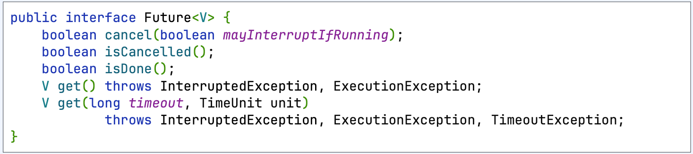

# CompletableFuture

## (1) CompletableFuture = CompletableStage + Future

### 1. Future vs CompletableStage

1. Future
   - 비동기적인 작업을 수행
   - 해당 작업이 완료되면 결과를 반환하는 인터페이스
2. CompletableStage
   - 비동기적인 작업을 수행
   - 해당 작업이 완료되면 결과를 처리하거나 다른 CompletableStage 로 연결하는 인터페이스

### 2. Future

- isCancelled() : 작업이 취소되었는지 여부를 반환 (비동기 작업 취소 상태 확인) 
- isDone() : 작업이 완료되었는지 여부를 반환 (비동기 작업 완료 상태 확인)

> 🚨 Future interface 한계
> - cancel 을 제외하고 외부에서 future 을 컨트롤 할 수 없다.
> - 반환된 결과를 get() 해서 접근하기 때문에 비동기 처리가 어렵다.
> - 완료 여부와 에러가 발생했는지 구분하기가 어렵다.

