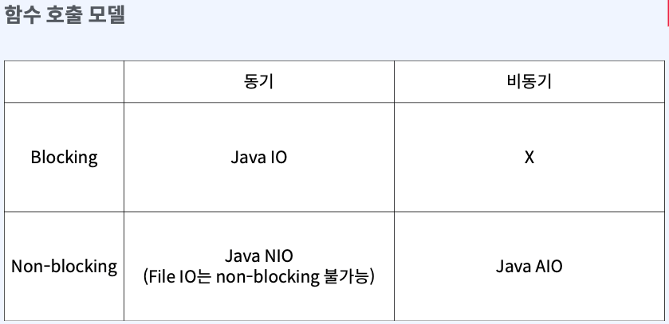
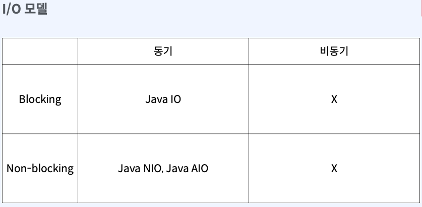
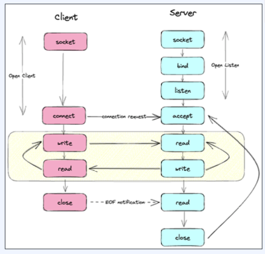
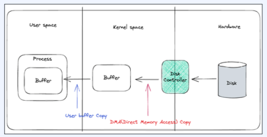
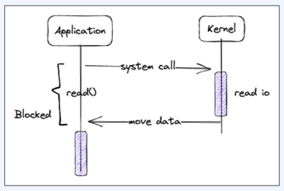

# 1. Java NIO

## 1. Java IO, NIO, AIO 호출 모델 관점 

### 1. 함수 호출자 관점 



1. Java IO : 동기 + Blocking  (동기식, 블로킹)
   - caller 가 I/O 요청을 하는 동안 아무것도 하지 못하고 응답이 돌아왔을 때 caller 가 직접 처리하는 구조 
2. Java NIO : 동기 + Non-Blocking (동기식, 논블로킹)
   - File I/O 는 non-blocking 이 불가능, Socket I/O 만 non-blocking 가능
3. Java AIO(Java NIO2) : 비동기 + Non-Blocking (비동기식, 논블로킹)

### 2. OS 커널 관점 



1. Java IO : 동기 + Blocking
    - read() system call 이 호출되면 내부적으로 동기 + blocking 방식으로 동작
    - 커널이 I/O 작업이 완료될 때까지 프로세스를 블로킹
2. Java NIO + Java AIO : 동기 + Non-Blocking
    - epoll, kqueue 이벤트 기반 I/O 을 사용

## 2. Java I/O

### 1. Java I/O

1. Java 1.0 에서 처음 도입
2. 파일과 네트워크에 데이터를 읽고 쓸 수 있는 API 제공
3. byte 단위로 읽고 쓰는 stream 제공
4. blocking 기반으로 동작

## 3. InputStream

1. 제공 메서드
   1. read() : stream 데이터를 읽고, 읽은 값을 반환. -1 이라면 끝에 도달했다는 것을 의미
   2. close() : stream 을 닫고 더 이상 데이터를 읽지 않는다.
2. 특징
   1. 어떤 source 로 부터 데이터를 읽을지에 따라 다양한 구현체 존재
   2. 어떤 데이터 소스로부터 데이터를 읽을지에 따라 다양한 구현체 존재
      - FileInputStream : 파일로 부터 데이터를 읽음
      - ByteArrayInputStream : 바이트 배열로 부터 데이터를 읽음 (source : 메모리)
      - BufferedInputStream : 메모리 버퍼로 부터 데이터를 읽음 

### 1. FileInputStream

- file 로 부터 byte 단위로 데이터를 읽음
- File 객체나 path 를 통해 FileInputStream 객체 생성
- application 에서 blocking 이 일어난다.

```kotlin
import org.slf4j.LoggerFactory
import java.io.File
import java.io.FileInputStream

private val log = LoggerFactory.getLogger("FileInputStreamExample")

fun main() {
   log.info("start main")
   val file = File(
           {}.javaClass.classLoader
                   .getResource("data.txt")!!.file
    )

   FileInputStream(file).use { fis ->
           var value: Int
      while (fis.read().also { value = it } != -1) {
         log.info("value: {}", value.toChar())
      }
   }
   log.info("end main")
}
```

### 2. BufferedInputStream

- decorator 패턴으로 다른 InputStream 을 조합해서 사용
- 임시 저장 공간인 버퍼(buffer) 를 사용해 한번 read() 를 호출할 때 buffer 사이즈만큼 미리 조회
- 그 이후 read 를 호출할 때 미리 저장한 buffer 에서 데이터를 읽음
- 장점 : 파일에 대한 I/O 횟수를 줄여 성능 향상

```kotlin
import org.slf4j.LoggerFactory
import java.io.BufferedInputStream
import java.io.File
import java.io.FileInputStream

private val log = LoggerFactory.getLogger("BufferedInputStreamExample")

fun main() {
    log.info("start main")

    val resource = {}.javaClass.classLoader.getResource("data.txt")
        ?: throw IllegalStateException("data.txt not found in resources")

    val file = File(resource.file)

    FileInputStream(file).use { fis ->
        BufferedInputStream(fis).use { bis ->
            var value: Int
            while (bis.read().also { value = it } != -1) {
                log.info("value: {}", value.toChar())
            }
        }
    }

    log.info("end main")
}
```

### 3. SocketInputStream

> 외부 클라이언트가 요청을 보냈을 때 요청 안에 값이 들어있다면 그 값에 접근 가능한 inputStream



1. serverSocket accept()
   - serverSocket 을 open 하여 외부의 요청을 수신
   - bind(), accept() 를 통해서 serverSocket open 을 준비
2. SocketInputStream
   - SocketInputStream 은 public 이 아니라 package private 하므로 직접 접근이 불가
   - socket.getInputStream() 을 통해서 SocketInputStream 에 접근 가능
   - blocking 방식으로 동작

```kotlin
import org.slf4j.LoggerFactory
import java.io.BufferedInputStream
import java.net.ServerSocket

private val log = LoggerFactory.getLogger("ServerSocketInputStreamExample")

fun main() {
    log.info("start main")

    ServerSocket(8080).use { serverSocket ->
        // 클라이언트 접속 대기
        serverSocket.accept().use { clientSocket ->
            clientSocket.getInputStream().use { inputStream ->
                BufferedInputStream(inputStream).use { bis ->
                    val buffer = ByteArray(1024)
                    val bytesRead = bis.read(buffer)
                    if (bytesRead != -1) {
                        val inputLine = String(buffer, 0, bytesRead)
                        log.info("bytes: {}", inputLine)
                    }
                }
            }
        }
    }

    log.info("end main")
}
```

```bash
$ curl http://localhost:8080 -d "hello world"

13:56:03.600 [main] INFO ServerSocketInputStreamExample -- start main
13:56:07.953 [main] INFO ServerSocketInputStreamExample -- bytes: POST / HTTP/1.1
Host: localhost:8080
User-Agent: curl/8.7.1
Accept: */*
Content-Length: 11
Content-Type: application/x-www-form-urlencoded

hello world
13:56:07.957 [main] INFO ServerSocketInputStreamExample -- end main
```

```bash
$ nc localhost 8080 # hello world 입력

13:56:03.600 [main] INFO ServerSocketInputStreamExample -- start main
13:56:07.953 [main] INFO ServerSocketInputStreamExample -- bytes: hello world
13:56:07.957 [main] INFO ServerSocketInputStreamExample -- end main
```

## 4. OutputStream

1. write 시 바로 전송하지 않고 버퍼에 저장한 다음 일정량의 데이터가 모이면 한번에 전달
2. Closable 인터페이스를 구현해 명시적 close() 호출 또는 try-with-resources 구문으로 자원 해제
3. blocking 방식으로 동작
4. 종류
   - ByteArrayOutputStream : 메모리 버퍼에 바이트 배열로 출력
   - FileOutputStream : 파일에 바이트 단위로 출력
   - BufferedOutputStream : 메모리 버퍼에 바이트 단위로 출력

### 1. 메서드

1. write(int b) : 1byte 씩 stream 으로 데이터를 쓴다.
2. flush() : 버퍼에 남아있는 데이터를 강제로 출력하고 비운다.
3. close() : stream 을 닫고 더 이상 데이터를 쓰지 않는다.

### 2. ByteArrayOutputStream

1. byte array 에 데이터를 쓴다.
2. 메모리가 destination 이 된다.

### 3. FileOutputStream

1. file 에 값을 쓸 수 있다.
2. File 객체나 path 를 통해 FileOutputStream 객체 생성
3. application 에서 blocking 이 일어난다.

### 4. BufferedOutputStream

1. 다른 OutputStream 을 조합해서 사용
2. 임시 저장 공간인 버퍼(buffer) 를 사용해 한번 write() 를 호출
3. 추후 flush() 가 호출되거나 버퍼가 가득 찼을 때 실제 출력

```kotlin
import org.slf4j.LoggerFactory
import java.io.File
import java.io.FileOutputStream


private val log = LoggerFactory.getLogger("FileOutputStreamExample")

fun main() {
    log.info("start main")

    // 현재 실행 경로 기준으로 output 폴더 생성
    val outputDir = File("output")
    if (!outputDir.exists()) {
        outputDir.mkdirs() // output 폴더 없으면 생성
    }

    val file = File(outputDir, "dest.txt")

    FileOutputStream(file).use { fos ->
        val content = "Hello World"
        fos.write(content.toByteArray())
        fos.flush()
    }

    log.info("end main, file path = {}", file.absolutePath)
}
```

> OutputStream 도 버퍼를 가지는데 BufferedOutputStream 을 사용하는 이유?
> - 버퍼 크기를 지정할 수 있기 때문이다.

### 5. SocketOutputStream

- SocketOutputStream 은 public 이 아니라 package private 하므로 직접 접근이 불가
- socket.getOutputStream() 을 통해서 SocketOutputStream 에 접근 가능
- blocking 방식으로 동작

```kotlin
private val log = LoggerFactory.getLogger("ServerSocketOutputStreamExample")

fun main() {
    log.info("start main")

    ServerSocket(8080).use { serverSocket ->
        // 클라이언트 접속 대기
        serverSocket.accept().use { clientSocket ->
            // 클라이언트가 보낸 데이터를 읽기
            val inputBuffer = ByteArray(1024)
            val bytesRead = clientSocket.getInputStream().read(inputBuffer)
            if (bytesRead != -1) {
                val received = String(inputBuffer, 0, bytesRead)
                log.info("received: {}", received)
            }

            // 클라이언트로 데이터 보내기
            clientSocket.getOutputStream().use { outputStream ->
                BufferedOutputStream(outputStream).use { bos ->
                    val message = "Hello World".toByteArray()
                    bos.write(message)
                    bos.flush()
                    log.info("sent: Hello World")
                }
            }
        }
    }

    log.info("end main")
}
```
```bash
$ nc localhost 8080
123 #송신 메시지
Hello World # 수신 메시지

## 서버 로그
14:32:03.846 [main] INFO ServerSocketOutputStreamExample -- start main
14:32:09.994 [main] INFO ServerSocketOutputStreamExample -- received: 123

14:32:09.996 [main] INFO ServerSocketOutputStreamExample -- sent: Hello World
14:32:09.998 [main] INFO ServerSocketOutputStreamExample -- end main
```

## Java IO 한계

1. 동기 + blocking 방식
   - I/O 작업이 완료될 때까지 쓰레드가 블로킹
   - 많은 수의 동시 연결 처리에 비효율적
2. 커널 버퍼에 직접 접근 불가
   - Java IO 는 커널 버퍼에 직접 접근할 수 없음. 따라서 메모리 복사 오버헤드 발생

### (1) 커널 버퍼에 직접 접근 불가

1. H/W 에서 값을 읽어오면 disk controller 가 DMA 를 통해서 커널 버퍼에 값을 복사
2. 커널 버퍼에서 JVM 버퍼로 복사 (이 과정에서 CPU 자원 소모)
3. JVM 버퍼, JVM 메모리에 있기 때문에 GC 대상이 되고 이 또한 CPU 자원 소모


> DMA(Direct Memory Access)
> - 컴퓨터에서 CPU를 거치지 않고 주변 장치와 메모리 간에 데이터를 직접 전송하는 기술로, CPU의 작업 부담을 줄이고 데이터 전송 효율을 높입니다.


 

### (2) 동기 + Blocking 으로 동작

1. application이 read를 호출하면, kernel이 응답을 반환할 때까지, 아무것도 안하고 대기해야 한다.
2. I/O 요청이 발생할 때마다 쓰레드를 새로 할당하면, 쓰레드를 생성 및 관리하는 비용과 컨텍스트 스위칭으로 인한 cpu 자원 소모


