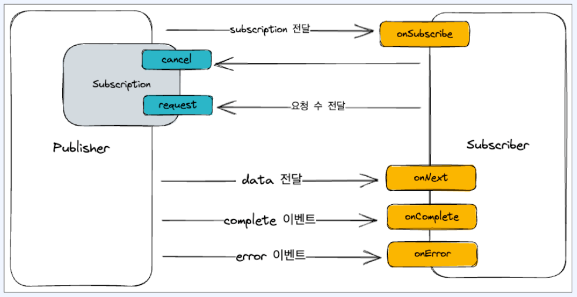
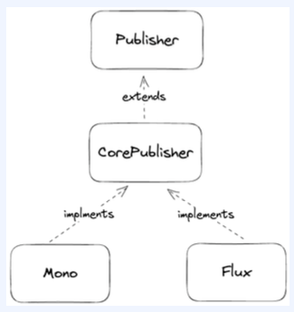

# 1. Reactive streams 

## (1) 역사

1. 2011.06 - MS .NET Reactive Extensions (Rx) 발표
2. 2013.02 - Netflix RxJava 오픈소스 공개 (ver 0.5)
3. 2013.09 - Reactive manifesto v1 발표
4. 2013.11 - Pivotal Project Reactor 배포 (ver 1.0.0)
5. 2014.09 - Reactive manifesto v2 발표
6. 2014.11 - RxJava ver 1.0.0 출시
7. 2015.04 - Reactive Streams 1.0.0 + java 9 와 함께 배포

## (2) 배경

1. Netflix 트래픽 증가로 인한 문제 발생
    - 2010년 기준 일일 2000만 건의 요청 -> 2013 년 기준 일일 20억 건 요청 (100배 증가)
    - 클라이언트 개선을 통해 다중 API 요청을 단건 API 요청으로 변경 (Network Latency 개선 목적)
    - 서버 입장에서 트래픽 처리에 있어서 큰 개선 효과가 없음
    - Netflix RxJava 기반 비동기 처리를 통해 도입을 통해 데이터 조회를 개선하는 방식으로 개선


# 2. Reactive manifesto

## (1) Reactive manifesto ??

1. Reactive Systems 를 만들기 위한 구성 요소에 관한 가이드라인(선언문)
2. 핵심 가치 : Responsive(응답성), Resilient(복원력), Elastic(유연성), Message Driven(메시지 기반)
   - 응답성 : 문제를 신속히 탐지하고 효과적으로 대처해 일관성 있는 응답 시간 제공 및 품질 제공하여 **가능한 한 즉각적으로 응답** 
   - 복원성 : 구성요 요소를 서로 분리하고 복구 프로세스는 다른 구성 요소에게 위임이 가능해 **장애에 직면하더라도 응답성을 유지**
   - 유연성 : 규모 확장(e.g. 샤딩, 복제) 을 기반한 병목 현상 개선을 통해 **작업량이 변화에 따른 유연한 응답성을 유지**
   - 메시지 기반 : 구성 요소는 서로 비동기적 메시지를 주고 받으며, 독립적인 실행을 보장 + 메시지 큐를 생성하고 배압을 적용하여 부하 관리 가능
3. Reactive System 의 모든 구성 요소가 Reactive 하게 동작해야 해야 전체 시스템이 Reactive System 이 될 수 있음

> [manifesto summary]
> 핵심 가치 : 가능한 한 즉각적으로 응답
> 첫 번째 형태 1: 장애에 직면하더라도 응답성을 유지
> 두 번째 형태 : 작업량이 변화하더라도 응답성을 유지
> 방법 : asynchronous non-blocking 기반 메시지 큐를 사용해서 통신한다.

> [manifesto v1 -> v2]
> v1 : **interactive**, resilient, scalable, ,  **event-driven**
> v2 : **responsive**, resilient, elastic, **message-driven**

- interactive -> responsive, event-driven -> message-driven 으로 변경된 이유는??

## (2) Reactive Programming

1. 일반적인 서비스
   - 객체는 다른 객체를 직접 호출하고 데이터를 받는다. (synchronous, blocking)
   - 경계가 무너지고 구성 요소의 독립적인 실행을 보장하지 않아 복원력, 유연성이 낮아진다.
2. stream 을 이용한 흐름
   - caller 는 collect 를 통해 값을 조회해야 한다. caller 와 callee 는 동기적으로 동작
   - message queue 생성 및 back-pressure 적용하여 부하 관리 및 흐름 제어 -> stream 이 message queue 역할을 하지만 부하 관리를 할 수 없음
3. future 를 이용한 흐름
   - 비동기적 메시지를 주고 받으며, 독립적인 실행을 보장 -> caller 와 callee 는 비동기적으로 동작
   - message queue 생성 및 back-pressure 적용하여 부하 관리 및 흐름 제어 -> future 메시지 큐 역할을 할 수 없고, 부하를 관리할 수 없다. 배압도 적용 불가

> 요청에 반응하는 stream 을 사용할 수 없을까??

4. Reactive stream
   - callee 는 caller 에게 응답이 아닌 publisher 를 제공 (publisher 가 mq 역할)
   - callee 는 각각의 값을 publisher 를 통해 전달
   - caller 는 해당 publisher 를 subscribe 하거나 다른 caller 에게 전달
   - caller 는 subscriber 를 등록하여 back-pressure 를 조절해 처리 가능한만틈 전달 받음.

## (3) event-driven vs message-driven

1. message : event, command, query 등 다양한 의미를 포함
2. message-driven 은 event, command, query 등 모든 메시지를 비동기 처리 + 배압 적용해서 전달하는 형태에 집중
3. event-driven 은 이벤트에 집중
4. completion, error 심지어 값 까지도 이벤트 형태로 전달
5. 따라서 reactive programming 은 reactive manifesto 의 원칙을 지킨다.

# 3. Reactive Streams

## (1) 구조

1. publisher : 데이터 or 이벤트를 발행하는 주체
2. subscriber : 발행된 데이터 or 이벤트를 구독하는 주체
3. subscription : publisher 와 subscriber 간의 데이터 흐름을 조절하는 주체



## (2) Hot Publisher vs Cold Publisher

1. Hot Publisher
   - subscriber 가 없더라도 데이터를 생성하고 stream 에 푸쉬하는 publisher
   - 예시) 트위터 게시글 읽기, 공유 리소스 변화 등 (외부에 변화에 의해서 변경되는 데이터)
   - 여러 subscriber 가 동일한 데이터한 데이터 전달
   - 실시간성이 중요한 데이터를 제공하는데 적합
   - sample code : https://github.com/pbg0205/reactive-study/blob/master/chapter01/src/main/kotlin/kr/cooper/chapter01/reactivestreams/SimpleHotPublisher.kt
2. Cold Publisher
   - subscriber 가 구독을 시작할 때 데이터를 생성하고 stream 에 푸쉬하는 publisher
   - 예시) 파일 읽기, 웹 API 요청 등
   - subscriber 에 따라 독립적인 데이터 스트림 제공
   - Subscriber 한테만 중요한 정보를 제공하는데 적합
   - sample code : https://github.com/pbg0205/reactive-study/blob/master/chapter01/src/main/kotlin/kr/cooper/chapter01/reactivestreams/SimpleColdPublisher.kt

# 4. Reactive Streams 구현 라이브러리

## (1) 종류

- 종류 : Project reactor, RxJava, Mutiny, Akka Streams, Vert.x 등

## (2) Project Reactor

- Spring reactor 에서 사용
- Mono 와 Flux publisher 제공



## (3) Flux

### 1. 메서드 종류
- 0 ~ N 개의 데이터를 발행하는 publisher
- onSubscribe() : 구독이 시작될 때 호출 (subscribe 하지 않으면 아무 일도 일어나지 않음)
- onNext() : 데이터가 발행될 때마다 호출 (onSubscribe() 이후에 여러 번 호출 가능)
- onError() : 에러가 발생했을 때 호출
- onComplete() : 모든 데이터가 정상적으로 발행되었을 때 호출
- subscribeOn() : 다른 스레드에 할당해서 실행하고자 하는 경우 호출

### 2. backPressure

1. subscriber 는 onNext() 호출에서 처리할 수 있는 데이터 개수를 지정할 수 있음
2. 이로써 subscriber 에서 감당하기 데이터 양을 조절 가능하다. (backPressure)

```kotlin
import org.slf4j.LoggerFactory
import reactor.core.publisher.Flux

fun main() {
    val log = LoggerFactory.getLogger("FluxContinuousRequestSubscriberExample")

    log.info("start main")
    getItems().subscribe(ContinuousRequestSubscriber())
    log.info("end main")

    Thread.sleep(1000)
}

private fun getItems(): Flux<Int> {
    return Flux.fromIterable(listOf(1, 2, 3, 4, 5))
}
```

```kotlin
package kr.cooper.chapter01.reactor

import org.reactivestreams.Subscriber
import org.reactivestreams.Subscription
import org.slf4j.LoggerFactory

class ContinuousRequestSubscriber<T> : Subscriber<T?> {
    private val count: Long = 1
    private lateinit var subscription: Subscription
    private val log = LoggerFactory.getLogger("ContinuousRequestSubscriber")

    override fun onSubscribe(s: Subscription) {
        this.subscription = s
        log.info("subscribe")
        s.request(count)
        log.info("request(onSubscribe): {}", count)
    }

    override fun onNext(t: T?) {
        log.info("item: {}", t)

        Thread.sleep(1000)
        subscription.request(1) // onNext() 를 통해 Subscriber 가 처리할 수 있는 데이터 개수를 지정
        log.info("request: {}", count)
    }

    override fun onError(t: Throwable) {
        log.error("error: {}", t.message)
    }

    override fun onComplete() {
        log.info("complete")
    }
}
```

### 3. Flux - error

- Flux 는 에러가 발생하면 onError() 호출 후 스트림이 종료된다.
  - fluxSink : Reactor의 Flux.create 에서 사용되는 객체로, 데이터를 스트림에 직접 방출(push)할 수 있게 해줌

```kotlin
import org.slf4j.LoggerFactory
import reactor.core.publisher.Flux

fun main() {
   val log = LoggerFactory.getLogger("FluxContinuousRequestSubscriberExample")

   log.info("start main")
   getItems().subscribe(SimpleSubscriber(Int.MAX_VALUE))
   log.info("end main")

   Thread.sleep(1000)
}

private fun getItems(): Flux<Int> {
   return Flux.create { fluxSink ->
      fluxSink.next(0)
      fluxSink.error(RuntimeException("exception in flux"))
      fluxSink.next(1)
   }
}
```

```text
22:47:03.788 [main] INFO FluxContinuousRequestSubscriberExample -- start main
22:47:03.920 [main] INFO SimpleSubscriber -- subscribe
22:47:03.920 [main] INFO SimpleSubscriber -- request 2147483647
22:47:03.930 [main] INFO SimpleSubscriber -- item: 0
22:47:04.046 [main] ERROR SimpleSubscriber -- error: exception in flux
22:47:04.046 [main] DEBUG reactor.core.publisher.Operators -- onNextDropped: 1
22:47:04.046 [main] INFO FluxContinuousRequestSubscriberExample -- end main
```

```kotlin
import org.reactivestreams.Subscriber
import org.reactivestreams.Subscription
import org.slf4j.LoggerFactory

class SimpleSubscriber<T> (private val count: Int): Subscriber<T> {

   private val log = LoggerFactory.getLogger(SimpleSubscriber::class.java)

   override fun onSubscribe(subscription: Subscription) {
      log.info("subscribe")
      subscription.request(count.toLong())
      log.info("request {}", count)
   }

   override fun onNext(item: T) {
      log.info("item: {}", item)
      Thread.sleep(100)
   }

   override fun onError(throwable: Throwable) {
      log.error("error: {}", throwable.message)
   }

   override fun onComplete() {
      log.info("complete")
   }
}
```

### 4. Flux - complete

- Flux 는 아무 값도 전달하지 않는 상태에서 complete() 호출 시 onComplete() 호출 후 스트림이 종료된다.
- onSubscribe() -> onComplete() 순서로 바로 호출

```kotlin
package kr.cooper.chapter01.reactor

import org.reactivestreams.Subscriber
import org.reactivestreams.Subscription
import org.slf4j.LoggerFactory

class SimpleSubscriber<T> (private val count: Int): Subscriber<T> {

    private val log = LoggerFactory.getLogger(SimpleSubscriber::class.java)

    override fun onSubscribe(subscription: Subscription) {
        log.info("subscribe")
        subscription.request(count.toLong())
        log.info("request {}", count)
    }

    override fun onNext(item: T) {
        log.info("item: {}", item)
        Thread.sleep(100)
    }

    override fun onError(throwable: Throwable) {
        log.error("error: {}", throwable.message)
    }

    override fun onComplete() {
        log.info("complete")
    }
}
```

```text
22:51:33.114 [main] INFO SimpleSubscriber -- subscribe
22:51:33.114 [main] INFO SimpleSubscriber -- request 2147483647
22:51:33.118 [main] INFO SimpleSubscriber -- complete
22:51:33.118 [main] INFO FluxContinuousRequestSubscriberExample -- end main
```

## (4) Mono

- 0 ~ 1 개의 데이터를 발행하는 publisher
- 메서드는 Flux 와 동일

### (1) Mono 를 사용하는 이유 : Flux 에서 하나의 값만 넘겨주면 되지 않나요?

- 1개의 아이템만 전달하기 때문에 next 하나만 실행하면 compelete 가 보장
- 혹은 전달하지 않고 complete 를 하면 값이 없다는 것을 의미
- 따라서 Mono 는 단일 값 또는 빈 값을 명확히 표현하는데 적합

### (2) Mono 와 Flux

1. Mono
   - Mono<T> : Optional<T> 와 유사 (값이 있거나 없거나)
   - Mono<Void> : 특정 사건이 완료되는 시점을 가리킬 수 있다.
2. Flux
    - Flux<T> : List<T> 와 유사 (무한하거나 유한한 여러 개의 값)

## (5) Flux 를 Mono 변환

### (1) Mono.from(Flux) 을 통해 첫번 째 값만 전달 가능

`Mono.from(Flux)`
```kotlin
import reactor.core.publisher.Flux
import reactor.core.publisher.Mono

fun main() {

   val log = org.slf4j.LoggerFactory.getLogger("FluxToMonoExample")

   log.info("start main")
   Mono.from<Int?>(items)
      .subscribe(SimpleSubscriber(Int.MAX_VALUE))
   log.info("end main")
}

private val items: Flux<Int> = Flux.fromIterable(mutableListOf(1, 2, 3, 4, 5))
```

```text
23:09:13.792 [main] INFO FluxToMonoExample -- start main
23:09:13.816 [main] INFO kr.cooper.chapter01.reactor.SimpleSubscriber -- subscribe
23:09:13.816 [main] INFO kr.cooper.chapter01.reactor.SimpleSubscriber -- request 2147483647
23:09:13.818 [main] INFO kr.cooper.chapter01.reactor.SimpleSubscriber -- item: 1
23:09:13.922 [main] INFO kr.cooper.chapter01.reactor.SimpleSubscriber -- complete
23:09:13.922 [main] INFO FluxToMonoExample -- end main
```

### (2) collectList() : Flux 의 모든 값을 collect 하고 complete 이벤트가 발생하는 시점에 모든 값들을 전달

`collectList()`
```kotlin
import org.slf4j.LoggerFactory
import reactor.core.publisher.Flux
import reactor.core.publisher.Mono

fun main() {

    val log = LoggerFactory.getLogger("FluxToMonoExample")

    log.info("start main")

    items.collectList()
        .subscribe(SimpleSubscriber(Int.MAX_VALUE))
    
    log.info("end main")
}

private val items: Flux<Int> = Flux.fromIterable(mutableListOf(1, 2, 3, 4, 5))
```

```text
23:12:46.842 [main] INFO FluxToMonoExample -- start main
23:12:46.873 [main] INFO SimpleSubscriber -- subscribe
23:12:46.873 [main] INFO SimpleSubscriber -- request 2147483647
23:12:46.874 [main] INFO SimpleSubscriber -- item: [1, 2, 3, 4, 5]
23:12:46.981 [main] INFO SimpleSubscriber -- complete
23:12:46.982 [main] INFO FluxToMonoExample -- end main
```

> ❓ 그러면 API 에서 Flux 를 사용하는 경우는 언제지??

## (6) Mono 를 Flux 변환

1. flux() : Mono 를 next 한 번 호출하고 onComplete 호출하는 Flux 로 변환
2. flatMapMany() : Mono 의 값을 여러 개의 값을 전달하는 Flux 로 만들고 연결

`flux()`

```kotlin
import org.slf4j.LoggerFactory
import reactor.core.publisher.Mono

fun main() {

    val log = LoggerFactory.getLogger("FluxToMonoExample")

    log.info("start main")
    items.flux()
        .subscribe(SimpleSubscriber(Int.MAX_VALUE))
    log.info("end main")
}

private val items: Mono<List<Int>> = Mono.just(listOf(1, 2, 3, 4, 5))
```

```text
23:18:30.070 [main] INFO FluxToMonoExample -- start main
23:18:30.149 [main] INFO SimpleSubscriber -- subscribe
23:18:30.149 [main] INFO SimpleSubscriber -- request 2147483647
23:18:30.151 [main] INFO SimpleSubscriber -- item: [1, 2, 3, 4, 5]
23:18:30.257 [main] INFO SimpleSubscriber -- complete
```

`flatMapMany()`

```kotlin
fun main() {

    val log = LoggerFactory.getLogger("FluxToMonoExample")

    log.info("start main")
    items.flatMapMany { value -> Flux.fromIterable(value) }
        .subscribe(SimpleSubscriber(Int.MAX_VALUE))
    log.info("end main")
}

private val items: Mono<List<Int>> = Mono.just(listOf(1, 2, 3, 4, 5))
```

```text
23:26:20.101 [main] INFO FluxToMonoExample -- start main
23:26:20.152 [main] INFO SimpleSubscriber -- subscribe
23:26:20.152 [main] INFO SimpleSubscriber -- request 2147483647
23:26:20.153 [main] INFO SimpleSubscriber -- item: 1
23:26:20.256 [main] INFO SimpleSubscriber -- item: 2
23:26:20.359 [main] INFO SimpleSubscriber -- item: 3
23:26:20.460 [main] INFO SimpleSubscriber -- item: 4
23:26:20.561 [main] INFO SimpleSubscriber -- item: 5
23:26:20.664 [main] INFO SimpleSubscriber -- complete
23:26:20.664 [main] INFO FluxToMonoExample -- end main
```
