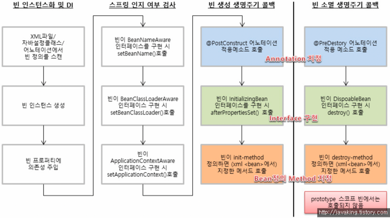

# Bean life cycle

## 1. Bean 라이프 사이클

1. **빈 인스턴스화 및 DI** : 설정 파일이나 어노테이션을 읽어 Bean 객체를 생성
2. **스프링 인지 여부 검사** : 스프링이 해당 정보를 Bean에 전달
   - BeanNameAware → 자신의 Bean 이름을 알 수 있음 
   - ApplicationContextAware → ApplicationContext에 접근 가능
3. **빈 생성 생명주기 콜백**
4. **빈 소멸 생명주기 콜백**

## 2. Bean 라이프 사이클 메서드 호출 흐름

1. 빈 인스턴스화 및 DI
    1. XML 파일, @Configuration 클래스, @ComponentScan 어노테이션을 통해 빈 정의를 스캔
    2. 빈 인스턴스 생성
    3. 빈 프로퍼티에 의존성 주입
2. 스프링 인지 여부 검사
    1. setBeanName() 메서드 호출 (빈에서 BeanNameAware 인터페이스 구현 시)
    2. setBeanClassLoader() 메서드 호출 (빈에서 BeanClassLoaderAware 인터페이스 구현 시)
    3. ApplicationContextAware 인터페이스 setApplicationContext() 메서드 호출 (빈에서 인터페이스 구현 시)
3. 빈 생성 생명주기 콜백
    1. @PostConstruct 어노테이션 적용 메서드 호출
    2. afterPropertiesSet() 메서드 호출 (빈에서 InitializingBean 인터페이스 오버라이딩 할 경우)
    3. init-method 호출 (xml 파일 or @Bean initMethod 속성 사용 시)
4. 빈 소멸 생명주기 콜백
    1. **@PreDestroy** 어노테이션 적용 메서드 호출
    2. **destroy()** 메서드 호출 (빈에서 인터페이스 DisposableBean 오버라이딩 할 경우)
    3. **destroy-method** 호출 (xml 파일 or @Bean destroyMethod 속성 사용 시)

